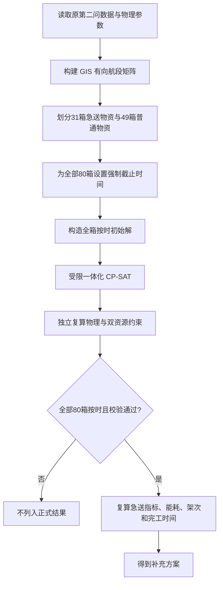

# D题第二问补充分析：急送物资优先配送模型

## 1. 补充分析的目的

第二问原模型从全部应急物资的整体配送效果出发，综合考虑送达及时性、完工时间、能耗和架次数。进一步考虑实际救灾中的物资差异后，可以提出一个更有针对性的补充问题：

> 当首批保障物资和医疗物资具有更强的早期送达需求时，是否可以优先改善这部分物资的送达时间，而对其他物资只要求不迟于规定时刻送达？

这一补充模型不替代第二问原模型，而是在相同 GIS、飞行物理、无人机、电池和配送数据之上，引入一种不同的决策偏好。原模型回答“如何改善全部物资的综合配送效果”，补充模型回答“在所有物资均按时的条件下，如何进一步优先保障急送物资”。

补充分析的核心变化不是修改无人机性能或地理数据，而是重新定义物资时限和优化目标：

1. 所有 80 箱物资仍必须全部送达；
2. 首批保障物资或医疗物资被归入急送集合；
3. 普通物资只要求不迟到，不再因额外提前而获得目标奖励；
4. 在全箱按时后，首先优化急送物资送达时间，再优化能耗、架次数和完工时间。

## 2. 急送物资与普通物资的划分

设全部物资箱集合为 $B$，急送物资集合为 $B^U$。急送集合定义为

$$
B^U=\{b\in B:b\text{ 为首批保障物资或医疗物资}\}.
$$

按照题目数据，共有 80 箱物资，其中：

- 急送物资 31 箱；
- 普通物资 49 箱。

该划分采用“或”关系。一箱物资只要属于首批保障物资或医疗物资中的任意一种，就被视为急送物资。如果同时具有两种属性，也只计入一次。

这种分类的实际含义是：首批保障物资承担灾后早期基本供给任务，医疗物资通常直接关系到救治需求，因此需要在全局排程中获得更高的时间优先级。饮用水、食品等未被归入急送集合的箱体仍然必须按时送达，只是不再追求无条件地越早越好。

## 3. 强制截止时间

设物资箱 $b$ 的期望送达时刻为 $\tau_b^{\mathrm{exp}}$，首批保障截止时刻为 $\tau_b^{\mathrm{first}}$，补充模型使用的最终强制截止为 $\bar\tau_b$。权重 $w_b$ 直接读取原始数据表中的“应急优先系数”，不是由质量、箱数或算法临时生成；因此补充指标沿用题目数据对不同物资重要程度的赋权。

对首批保障物资，沿用首批截止时间；对医疗物资，将期望送达时间作为强制截止；若一箱物资同时具有首批和医疗属性，则取两个时限中更早的一个。对普通物资，直接把期望送达时间作为强制截止。

因此，每一个物资箱都有必须满足的截止时刻：

$$
T_b^{\mathrm{delivery}}\le \bar\tau_b,
\qquad \forall b\in B.
$$

这里的关键区别是：原有硬时限主要针对首批和医疗物资，而补充模型把普通物资的期望送达时间也转化为硬约束。这样可以防止算法为了过度提前急送物资而无限推迟普通物资。

普通物资提前 10 分钟和提前 1 分钟，在补充模型的正式目标中没有区别；但只要超过期望时刻，就不再是可接受的正式方案。

## 4. 沿用的物理与 GIS 模型

补充模型完全沿用第二问主体部分的物理和 GIS 口径，不重新修改飞行参数。

### 4.1 航段距离与地形

节点坐标采用 WGS84，经纬度端点之间使用椭球大地距离。程序沿节点连线读取 DEM 栅格，取沿线最高有效地面高程。调度中心的操作高度取地面高程，服务区操作高度取地面以上 30 m，巡航高度取沿线最高地面以上 50 m。

设航段 $i\rightarrow j$ 的水平距离为 $d_{ij}$，爬升量和下降量分别为 $H_{ij}^{\uparrow}$、$H_{ij}^{\downarrow}$，则型号 $g$ 的飞行时间为

$$
t_{ijg}
=\frac{H_{ij}^{\uparrow}}{v_g^{\uparrow}}
+\frac{d_{ij}}{v_g^{\mathrm{cruise}}}
+\frac{H_{ij}^{\downarrow}}{v_g^{\downarrow}}.
$$

### 4.2 装载与逐段载荷

物资箱不可拆分。架次 $p$ 的起飞质量和体积满足

$$
\sum_{b\in B_p}m_b\le Q_{g_p}^{\max},
\qquad
\sum_{b\in B_p}v_b\le V_{g_p}^{\max}.
$$

在一个服务区完成交接后，该站物资从剩余载荷中扣除。后续航段根据新的剩余载荷计算航程和能耗，最后一站返回 O01 的航段按空载计算。

### 4.3 载荷相关航程与能耗

载荷为 $q$ 时，型号 $g$ 的等效航程为

$$
R_g(q)=R_g^0-\left(R_g^0-R_g^F\right)
\left(\frac{q}{Q_g^{\max}}\right)^{1.5}.
$$

水平飞行能耗和爬升附加能耗分别为

$$
E_{ijg}^{\mathrm{horizontal}}(q)
=\alpha E_g^{\mathrm{use}}\frac{d_{ij}}{R_g(q)},
$$

$$
E_{ijg}^{\mathrm{climb}}(q)
=\frac{(m_g^{\mathrm{empty}}+q)g_0H_{ij}^{\uparrow}}
{3.6\times10^6\eta_g^{\mathrm{climb}}}.
$$

本次补充实验固定采用基准标定系数 $\alpha=1.0$，安全余量为 20%。当前实现没有再设置一个独立的“累计飞行距离小于航程”约束；等效航程 $R_g(q)$ 进入各航段水平能耗计算，再由整架次能量上限和返航 SOC 间接限制可飞距离。若架次总能耗为 $E_p$，则必须满足

$$
E_p\le 0.8E_{g_p}^{\mathrm{use}}.
$$

### 4.4 时间口径

架次开始时刻 $T_p$ 表示准备和装载开始时刻，而不是无人机离地时刻。架次持续时间包括准备、装载、各航段飞行、服务区交接和返航。

物资送达时刻定义为所在服务区完成整站交接的时刻。若箱 $b$ 在架次 $p$ 中的送达偏移为 $\delta_{pb}$，则

$$
T_b^{\mathrm{delivery}}=T_p+\delta_{pb}.
$$

## 5. 无人机与电池双资源排程

所有可用无人机和满电电池在时刻 0 位于调度中心 O01。每个架次使用一架兼容型号的实体无人机和一块兼容型号的工作电池。若型号 $g$ 的可用电量为 $E_g^{\mathrm{use}}$，则返航 SOC 比例为

$$
s_p=1-\frac{E_p}{E_g^{\mathrm{use}}}.
$$

设该电池从 0% 充至 100% 的标称时间为 $T_k^{\mathrm{full}}$，从返航 SOC 充至 100% 的时间采用分段线性函数：

$$
C_p=
\begin{cases}
T_k^{\mathrm{full}}
\left[0.65\dfrac{0.9-s_p}{0.9}+0.35\right],
&s_p<0.9,\\[6pt]
T_k^{\mathrm{full}}\cdot0.35
\dfrac{1-s_p}{0.1},
&s_p\ge0.9.
\end{cases}
$$

程序实现的准确含义是：0%–90% 区间占完整充电时间的 65%，90%–100% 区间占 35%，并在各区间内线性插值。

无人机在架次开始至返航期间被占用：

$$
[T_p,T_p+D_p).
$$

电池除飞行外还需要在返航后完成充电，因此占用区间为

$$
[T_p,T_p+D_p+C_p),
$$

其中 $C_p$ 是从返航 SOC 充至 100% 所需的时间。

同一实体无人机的飞行区间不能重叠，同一电池的“飞行 + 充电”区间也不能重叠。无人机返航后可以较快承担下一任务，但原电池必须充满后才能再次使用，因此无人机和电池不能合并为一种资源进行排程。

## 6. 急送优先目标函数

补充模型只用急送物资计算提前送达指标。定义急送物资加权归一化送达时间为

$$
Z_{\mathrm{urgent}}
=\frac{
\sum_{b\in B^U}
w_bT_b^{\mathrm{delivery}}/\tau_b^{\mathrm{exp}}
}{
\sum_{b\in B^U}w_b
}.
$$

该指标越小，说明急送物资相对于各自期望时刻的加权平均送达比例越小。普通物资的提前量不进入这一指标。需要注意，该指标评价的是急送集合的加权平均表现，不直接最小化“最晚一箱急送物资”的送达比例；理论上允许少数急送箱更接近截止时刻，以换取其他高权重急送箱明显提前。若需要强调急送箱之间的公平性，可在后续扩展中增加最大送达比例或分位数目标，本轮没有加入该目标。

全部硬约束满足后，正式目标为

$$
\min_{\mathrm{lex}}
\left(Z_{\mathrm{urgent}},E,K,M\right),
$$

其中：

- $E$：全部架次总飞行能耗；
- $K$：总架次数；
- $M$：最后一架无人机的返航时刻。

词典序意味着先比较急送指标。只有两个方案的急送指标相同时，才比较能耗；能耗也相同时才比较架次数；前三项均相同时才比较完工时间。

在搜索过程中，为了让算法能够识别并修复暂时迟到的候选解，使用内部质量向量

$$
(H,L,Z_{\mathrm{urgent}},E,K,M),
$$

其中 $H$ 为迟到箱数，$L$ 为总迟到秒数。最终正式解必须满足 $H=L=0$。

## 7. 全箱按时初始解的构造

受限一体化 CP-SAT 从一份全箱按时初始解出发。该解包含完整的架次集合、开始时刻、无人机分配和电池分配，其构造过程为：

1. 按服务区、箱体容量和截止时间形成初始架次；
2. 对每个架次执行完整的容量、时间、能耗和 SOC 计算；
3. 使用确定性资源解码器分配实体无人机、电池和开始时刻；
4. 找出迟到物资，并优先处理急送物资；
5. 通过拆分架次、移动箱体、调整访问顺序或更换机型修复迟到；
6. 全箱按时后，再尝试合并架次、降低能耗和改善资源利用；
7. 每次调整后重新执行物理评估和双资源排程。

该初始解是 CP-SAT 的可行上界。它保证即使短时间搜索未产生改进，求解流程仍可以返回一个完整、可校验的全箱按时方案。初始解本身不构成全局最优证明。

## 8. 受限一体化 CP-SAT

第一种正式算法是受限一体化 CP-SAT。它把候选架次选择、开始时刻、实体无人机分配和实体电池分配放在一个约束规划模型中。

对每个候选架次建立是否采用的二元变量和开始时刻变量；对每一架兼容无人机、每一块兼容电池建立可选区间变量。模型包含：

- 每个箱恰好被一个架次覆盖；
- 全部箱的强制截止时间；
- 无人机型号和电池型号兼容；
- 同一无人机区间不重叠；
- 同一电池的飞行和充电区间不重叠；
- 共同种子的架次、时刻和资源分配提示。

CP-SAT 尝试分四个阶段依次求解：

1. 最小化 $Z_{\mathrm{urgent}}$；
2. 锁定急送目标后最小化总能耗；
3. 锁定前两项后最小化架次数；
4. 最后最小化完工时间。

为适应 CP-SAT 的整数模型，开始时刻按秒取整。对每个候选架次，程序分别计算并取整开始时刻系数
$\operatorname{round}(10^4\sum w_b/\tau_b^{\mathrm{exp}})$
和内部送达偏移项
$\operatorname{round}(10^4\sum w_b\delta_{pb}/\tau_b^{\mathrm{exp}})$；
能耗则按 $10^{-3}$ kWh 精度缩放为整数。因此 CP-SAT 直接优化的是与精确 $Z_{\mathrm{urgent}}$ 对应的整数代理目标，系数级取整可能改变极其接近方案的先后顺序。最终报告中的 $Z_{\mathrm{urgent}}$ 仍由连续公式独立复算。每阶段把求解器当前找到的代理目标值锁定，再进入下一阶段。只有当前阶段状态达到 OPTIMAL 时，该锁定值才是候选池内该代理目标的已证最优值；若状态仅为 FEASIBLE，锁定的是当前时间预算内找到的可行值。因此本次 CP-SAT 结果应理解为按词典序流程搜索得到的可行解，不能声称已在候选池内证明精确目标的严格词典序最优。

该方法被称为“受限一体化”，因为它只在程序生成的静态候选架次池中选择，并没有枚举所有可能的物资组合、访问顺序和机型组合。因此它可以统一处理池内的资源约束，但不能自动证明完整原问题的全局最优。

## 9. 补充模型的完整求解流程

求解程序只运行 20% 安全余量、$\alpha=1.0$ 的基准场景。CP-SAT 运行 1 次，其四个求解阶段共享 5 s 求解器时间上限；该计时从候选池和模型构建完成后开始，不包括候选生成、模型构建和最终复算，因此端到端时间可以超过 5 s。本补充分析没有使用 30% 安全余量场景，也没有进行新的敏感性分析。

## 10. 补充方案结果

| 求解方法 | 独立校验 | 求解状态 | $Z_{\mathrm{urgent}}$ | 能耗/kWh | 架次 | 完工时间/s | 最低返航 SOC |
|---|---|---|---:|---:|---:|---:|---:|
| 受限一体化 CP-SAT | PASS | FEASIBLE | 0.5883230237 | 66.3312 | 21 | 9853.28 | 20.9493% |

该方案满足：

- 80 箱物资全部且仅送达一次；
- 31 箱急送物资迟到数为 0；
- 49 箱普通物资迟到数为 0；
- 总迟到秒数为 0；
- 无人机占用重叠为 0；
- 电池飞行和充电占用重叠为 0；
- 容量约束，以及等效航程参与计算的能耗、返航 SOC 和 20% 安全余量约束全部通过；
- 报告目标与独立复算结果一致。

## 11. 结果解释

CP-SAT 方案共使用 21 个架次，在保证 31 箱急送物资和 49 箱普通物资全部按时的同时，得到急送物资加权归一化平均送达指标 0.5883230237。总飞行能耗为 66.3312 kWh，最后一架无人机在 9853.28 s 返航，最低返航 SOC 为 20.9493%，略高于 20% 安全余量要求。

该结果说明，在当前候选池和计算预算内，可以通过联合选择架次、安排开始时刻并分配实体无人机与电池，构造一个满足全箱截止时间的急送优先方案。由于求解状态为 FEASIBLE，该方案属于已验证可行解，而不是已证明最优解。

## 12. 独立校验

求解器输出后，由独立校验程序从最终架次明细重新计算：

1. 物资箱与目标服务区是否匹配；
2. 每个箱是否恰好出现一次；
3. 起飞质量、体积和逐段剩余载荷；
4. 航段时间、架次持续时间、能耗和返航 SOC；
5. 每个箱的实际送达时刻和强制截止；
6. 无人机飞行区间是否重叠；
7. 电池飞行与充电区间是否重叠；
8. 最终目标值是否与报告一致。

只有通过全部复算的方案才进入结果表。这样可以避免求解器内部代理成本、整数时间近似或缓存结果直接影响最终结论。

## 13. 与第二问主体内容的关系

急送优先模型是在第二问主体模型上的偏好扩展，二者共享同一套：

- 原始物资和设备数据；
- GIS 航段与 DEM 地形处理；
- 容量、航程、能耗和 SOC 计算；
- 准备、装载、交接和充电时间；
- 无人机与电池双资源约束；
- 独立校验程序。

两者的主要差别在于评价逻辑：主体模型可以继续用于说明全部物资的综合运输组织；补充模型则在全部物资按时的前提下，以首批和医疗物资的加权归一化平均送达指标作为第一优化层级，同时把普通物资的期望时刻作为不可违反的底线。

因此，论文中不应把补充模型描述为对原第二问结果的否定。更准确的解释是：在原问题基础上增加一种面向救灾优先级的决策情景，考察目标偏好变化后，最优运输组织如何调整。

## 14. 物理与 GIS 模型的边界

补充模型的结果在当前数据和模型口径下可复现，但不是对真实山区无人机飞行的完整数字孪生：

- DEM 只用于直线航段的最高地形，没有模拟绕山和动态避障；
- 节点高程和 DEM 默认采用兼容的垂直基准；
- 未考虑实时风场、降雨、温度和能见度；
- 未计悬停交接能耗、下降能量回收、通信载荷能耗和电池老化；
- 未建立充电桩数量、装卸人员、起降场排队和设备故障模型；
- 水平航程能耗和爬升附加能耗属于题面信息不足下的可复现建模假设。

因此，可以表述为“补充方案通过本文模型下的完整物理和资源校验”，不应表述为“已经精确还原真实山区飞行条件”。

## 15. 最优性说明

当前能够确认：

- CP-SAT 补充方案是当前模型下通过独立校验的可行解；
- 该方案保证 80 箱物资全部按时；
- 报告中的物理量、资源占用和目标值均已由独立校验器复算。

当前不能证明该方案是完整原问题的全局最优解。受限 CP-SAT 只覆盖已生成的候选架次池，求解状态为 `FEASIBLE` 而不是 `OPTIMAL`；目前没有覆盖所有物资组合和访问顺序的有效全局下界，也没有获得 `gap=0` 证书。

因此，严谨结论是：

> CP-SAT 的 21 架次方案是本轮候选池与计算预算下得到并通过独立校验的急送优先可行解，尚未证明为全局最优解。

## 16. 结果文件

- CP-SAT 逐架次与逐箱明细：`outputs/problem_d_q2_urgent_priority/integrated_milp/`
- CP-SAT 架次表：`outputs/problem_d_q2_urgent_priority/integrated_milp/trips.csv`
- CP-SAT 逐箱送达表：`outputs/problem_d_q2_urgent_priority/integrated_milp/deliveries.csv`
- CP-SAT 无人机时间线：`outputs/problem_d_q2_urgent_priority/integrated_milp/aircraft_timeline.csv`
- CP-SAT 电池时间线：`outputs/problem_d_q2_urgent_priority/integrated_milp/battery_timeline.csv`
- CP-SAT 校验结果：`outputs/problem_d_q2_urgent_priority/integrated_milp/validation.csv`

## 17. 补充分析总结

在第二问原有物理与资源模型基础上，补充分析将 31 箱首批保障或医疗物资定义为急送物资，并把其余 49 箱普通物资的期望送达时间转化为强制截止。在全部 80 箱按时的前提下，模型依次最小化急送物资加权归一化送达时间、总能耗、架次数和完工时间。受限一体化 CP-SAT 得到 21 架次可行方案，$Z_{\mathrm{urgent}}=0.5883230237$，能耗为 66.3312 kWh，完工时间为 9853.28 s，最低返航 SOC 为 20.9493%。该方案通过独立物理、时限和双资源校验，全部 80 箱零迟到。由于 CP-SAT 只在受限候选池内求解且最终状态为 FEASIBLE，该结果应表述为本轮候选池和计算预算下得到的已验证可行方案，而不能声称为全局最优方案。
