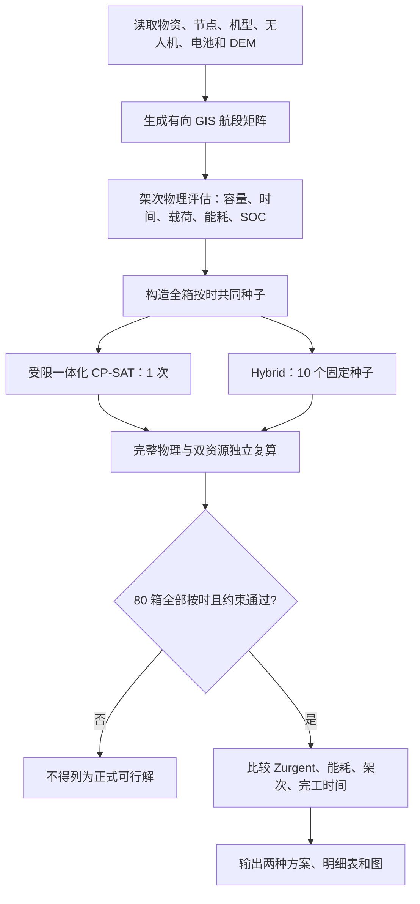

# D题第二问模型、算法、求解流程与结果说明

## 1. 研究问题与最终思路

第二问需要同时决定物资分组、架次机型、服务区访问顺序、任务开始时刻、实体无人机和实体电池分配。最终采用“急送优先、普通物资只需按时”的逻辑：

1. 80 箱物资必须全部且仅配送一次；
2. 首批保障物资或医疗物资为急送集合，共 31 箱；其余 49 箱为普通物资；
3. 急送物资使用原有首批截止时间和医疗期望时间中的较早者；
4. 普通物资不奖励额外提前，但其期望送达时间改为硬截止；
5. 全部物资按时后，首先提前急送物资，随后才依次降低能耗、架次数和完工时间。

这不是单纯路径问题或排程问题，而是三个层次的耦合：GIS 与飞行物理层决定距离、地形、航程和能耗；运输组织层决定分组、顺序和机型；资源排程层决定无人机、电池复用和充电周转。

## 2. 集合、参数和决策量

设 (B) 为物资箱集合，(B^U\subset B) 为急送集合，(N) 为调度中心和服务区节点集合，(G) 为无人机型号集合，(U) 为实体无人机集合，(K) 为实体电池集合，(P) 为候选或最终采用的架次集合。

对物资箱 (b)：(m_b,v_b) 为质量和体积，(s_b) 为目标服务区，(w_b) 为优先权重，\(\tau_b^{\mathrm{exp}}\) 为期望送达时刻，\(\bar\tau_b\) 为强制截止时刻。

$$
B^U=\{b:b\text{ 为首批保障物资或医疗物资}\}.
$$

急送物资同时存在首批截止和医疗期望时取较早者；其他急送物资取其适用的原截止；普通物资取期望送达时刻。因此每箱都有强制截止 \(\bar\tau_b\)。

一个架次 (p) 包含机型 (g_p)、物资集合 (B_p) 和从 O01 出发并回到 O01 的访问序列。主要决策量为：

- (y_p\in\{0,1\})：是否选择候选架次；
- (x_{pu}\in\{0,1\})：是否由实体无人机 (u) 执行；
- (z_{pk}\in\{0,1\})：是否使用实体电池 (k)；
- (T_p\)：架次开始准备的时刻，不是实际离地时刻；
- (T_b^{\mathrm{delivery}}\)：物资在目标服务区完成整站交接的时刻。

## 3. GIS 航段与地形口径

节点坐标采用 WGS84。节点 (i,j) 间水平距离 (d_{ij}) 使用椭球大地距离。程序在两节点连线经过的 DEM 栅格上取有效地面高程最大值 (h_{ij}^{\max})。调度中心操作高度取地面高程，服务区操作高度取地面以上 30 m；航段巡航高度取沿线最高地面以上 50 m：

$$
h_i^{\mathrm{op}}=
\begin{cases}h_i,&i=O01,\\h_i+30,&i\ne O01,\end{cases}
\qquad h_{ij}^{\mathrm{cruise}}=h_{ij}^{\max}+50.
$$

$$
H_{ij}^{\uparrow}=\max(0,h_{ij}^{\mathrm{cruise}}-h_i^{\mathrm{op}}),
\qquad
H_{ij}^{\downarrow}=\max(0,h_{ij}^{\mathrm{cruise}}-h_j^{\mathrm{op}}).
$$

型号 (g) 的航段时间为

$$
t_{ijg}=\frac{H_{ij}^{\uparrow}}{v_g^{\uparrow}}
+\frac{d_{ij}}{v_g^{\mathrm{cruise}}}
+\frac{H_{ij}^{\downarrow}}{v_g^{\downarrow}}.
$$

这是“端点大地距离 + 沿线最高 DEM 高程 + 单次爬升/下降”的可复现近似。它没有累计地形剖面的每次起伏，也没有模拟绕山、禁飞区、建筑、电线和风场，不能称为真实三维最短航迹。

## 4. 装载、航程、能耗和 SOC

物资箱不可拆分。架次 (p) 的起飞质量与体积满足

$$
Q_p=\sum_{b\in B_p}m_b\le Q_{g_p}^{\max},
\qquad
V_p=\sum_{b\in B_p}v_b\le V_{g_p}^{\max}.
$$

每站交接后扣除该站物资，后续航段按新的剩余载荷计算，末站返回 O01 时按空载计算。载荷为 (q) 时，等效航程为

$$
R_g(q)=R_g^0-(R_g^0-R_g^F)
\left(\frac{q}{Q_g^{\max}}\right)^{1.5}.
$$

水平能耗和爬升附加能耗分别为

$$
E_{ijg}^{\mathrm{horizontal}}(q)
=\alpha E_g^{\mathrm{use}}\frac{d_{ij}}{R_g(q)},
$$

$$
E_{ijg}^{\mathrm{climb}}(q)
=\frac{(m_g^{\mathrm{empty}}+q)g_0H_{ij}^{\uparrow}}
{3.6\times10^6\eta_g^{\mathrm{climb}}}.
$$

基准实验固定 (alpha=1.0)。架次总能耗是全部航段能耗之和，返航 SOC 为

$$
SOC_p^{\mathrm{return}}
=100\left(1-\frac{E_p}{E_{g_p}^{\mathrm{use}}}\right)\%.
$$

安全余量固定为 20%，故每个架次满足

$$
E_p\le0.8E_{g_p}^{\mathrm{use}}.
$$

## 5. 时间、送达和双资源排程

若架次携带 (n_p) 个箱，准备与装载时间为

$$
t_p^{\mathrm{pre}}=t_g^{\mathrm{prepare}}+n_pt_g^{\mathrm{load/box}}.
$$

架次开始时刻 (T_p) 是准备环节开始时刻。总持续时间包括准备、装载、全部航段、各站交接和返航。若箱 (b) 在架次中的送达偏移为 (delta_{pb})，则

$$
T_b^{\mathrm{delivery}}=T_p+\delta_{pb}.
$$

送达时刻定义为所在服务区完成整站交接的时刻，而不是刚到达时刻。

所有实体无人机和满电电池在时刻 0 位于 O01。每架次使用一块同型号电池。无人机占用区间为 ([T_p,T_p+D_p))，电池占用区间为 ([T_p,T_p+D_p+C_p))，其中 (C_p) 是按返航 SOC 计算的充电时间。无人机返航后可以复用，电池必须充至 100% 才能复用。同一无人机及同一电池的占用区间均不得重叠。

## 6. 硬约束

模型要求：

1. 每箱恰好被一个被选架次覆盖；
2. 质量、体积、航程、能量和返航安全余量满足对应机型限制；
3. 箱的目标服务区与停靠点一致；
4. 实体无人机和电池与机型兼容；
5. 无人机和电池占用区间无重叠；
6. 所有架次从 O01 出发并返回 O01；
7. 全部 80 箱满足

$$
T_b^{\mathrm{delivery}}\le\bar\tau_b,
\qquad \forall b\in B.
$$

普通物资提前多少不影响正式目标，只要不迟于其期望送达时刻。

## 7. 急送优先目标

急送物资的加权归一化送达指标为

$$
Z_{\mathrm{urgent}}
=\frac{\sum_{b\in B^U}w_bT_b^{\mathrm{delivery}}/\tau_b^{\mathrm{exp}}}
{\sum_{b\in B^U}w_b}.
$$

正式目标采用严格词典序：

$$
\min_{\mathrm{lex}}(Z_{\mathrm{urgent}},E,K,M),
$$

其中 (E) 为总飞行能耗，(K) 为架次数，(M) 为最后一架无人机返航时刻。只要 (Z_{\mathrm{urgent}}) 严格更小，即使能耗、架次和完工时间更大，该方案仍排在前面；只有当前层完全相同时才比较下一层。

搜索期间用

$$
(H,L,Z_{\mathrm{urgent}},E,K,M)
$$

比较候选，其中 (H) 为迟到箱数，(L) 为总迟到秒数。正式输出必须满足 (H=L=0)。

## 8. 共同全按时种子

两个正式算法使用相同的可行种子构造逻辑：按服务区和容量初始分组；对每个组合调用完整物理核；安排实体无人机和电池；提取迟到箱，优先修复急送箱，普通箱只修复到按时；再执行拆分、移动、合并、访问顺序调整和换机型。每次变动后都重新进行物理计算和双资源排程，最终得到覆盖 80 箱且零迟到的共同可行上界。

共同种子只是高质量可行上界，不是全局最优性证明。

## 9. 算法一：受限一体化 CP-SAT

CP-SAT 同时处理候选架次选择、开始时刻、实体无人机分配和实体电池分配。每个候选架次有选择变量和开始时刻变量，并为兼容无人机、电池建立可选区间。唯一覆盖约束保证每箱恰好配送一次，`NoOverlap` 约束保证资源占用不冲突。

全部箱的强制截止直接进入模型。共同种子的选择、时刻和资源分配作为求解提示。四个阶段依次求解并锁定上一阶段结果：急送送达指标、总能耗、架次数、完工时间。

该方法是“受限一体化”模型，因为它只在已生成的候选架次池内选择，并未枚举所有物资组合和访问顺序。本次状态为 `FEASIBLE` 而不是 `OPTIMAL`，不能作为原问题全局最优证明。

## 10. 算法二：Hybrid 混合算法

Hybrid 将分组局部搜索、ALNS 破坏修复和候选池重组串联：

1. 从共同全按时种子开始；
2. 随机移除、及时性最差移除、高能耗移除、同服务区移除或整架次移除；
3. 采用最小增量或 regret-2 规则重新插入；
4. 急送模式下优先处理迟到箱和急送箱；
5. 把新架次加入候选池，重新执行覆盖选择和资源排程；
6. 每个候选重新计算完整物理量；
7. 按 ((H,L,Z_{\mathrm{urgent}},E,K,M)) 更新最好解。

本次使用固定种子 20260924—20260933 共运行 10 次，正式 Hybrid 解取十次中的严格词典序最好结果。

## 11. 完整求解流程

## 12. 实验设置

本轮只运行一个基准场景：安全余量 20%，能量标定系数 (alpha=1.0)，CP-SAT 运行 1 次，Hybrid 运行 10 个固定种子；每次候选求解时间上限 5 s，Hybrid 邻域迭代数 20。

不运行 15%、25%、30%、35% 等安全余量场景，也不运行充电时间、资源数量、时限或能量标定敏感性分析。因此所有正式结果都属于 20% 安全余量基准，不存在 30% 场景混入结果的问题。

## 13. 两种正式方案结果

| 方法 | 独立校验 | 状态 | (Z_{\mathrm{urgent}}) | 能耗/kWh | 架次 | 完工时间/s | 最低返航 SOC |
|---|---|---|---:|---:|---:|---:|---:|
| 受限一体化 CP-SAT | PASS | FEASIBLE | 0.5883230237 | 66.3312 | 21 | 9853.28 | 20.9493% |
| **Hybrid** | **PASS** | **FEASIBLE** | **0.5823619191** | 74.2972 | 25 | 11483.34 | 20.9493% |

两种方案均满足：80 箱全部且仅配送一次；31 箱急送物资迟到数为 0；49 箱普通物资迟到数为 0；总迟到秒数为 0；无人机和电池重叠为 0；容量、航程、能耗和 20% 安全余量均通过；报告目标与独立复算一致。

## 14. 结果解释与选择

Hybrid 的 (Z_{\mathrm{urgent}}) 比 CP-SAT 方案降低约 1.0132%，说明急送物资整体更早完成交付。代价是总能耗增加约 12.0094%，架次数增加约 19.0476%，完工时间增加约 16.5434%。

按照严格词典序目标，Hybrid 是本轮最好已知方案，因为首要指标更小；后续能耗、架次和完工时间不能推翻首要目标的严格改善。

CP-SAT 的 21 架次方案是更紧凑的工程备选：能耗更低、架次更少、整体结束更早，而且同样保证全部物资按时。如果决策者不愿用约 12% 额外能耗和 4 个额外架次换取约 1.01% 的急送指标改善，可以选择该方案；但这属于改变偏好或接受目标折中，不是当前词典序下的排序结果。

## 15. Hybrid 多种子稳定性

10 个固定种子全部得到独立校验通过、零迟到的可行解。急送指标最小值 0.5823619191，最大值 0.5883230237，均值 0.5877269132，总体标准差 0.0017883314，平均运行时间约 6.89 s。

种子 20260928 找到 25 架次的最好急送方案；其余多数种子保留 21 架次共同种子。这说明改进解能够由算法原生搜索得到，但在当前短时预算下存在随机性和局部最优现象。

## 16. 独立校验与可信度

独立校验器从最终明细重新计算停靠点与目的地、容量、逐段载荷、GIS 航段时间、能耗、返航 SOC、逐箱送达时刻、强制截止、无人机占用、电池飞行与充电占用、覆盖完整性，以及 (Z_{\mathrm{urgent}},E,K,M)。搜索器内部缓存、代理成本或整数时间近似不能直接决定最终有效性，只有独立复算通过的解才写入比较表。

## 17. 物理与 GIS 边界

当前模型在题面数据范围内保持一致和可复现，但并非真实飞行数字孪生：

- DEM 只用于沿直线航段提取最高地形，没有动态避障和三维绕飞；
- 节点高程与 DEM 默认使用兼容的垂直基准；
- 未考虑风、降雨、温度、能见度和航速随机性；
- 未计下降能量回收、悬停交接能耗、通信设备能耗和电池老化；
- 未建模起降场容量、充电桩数量、装卸排队和故障；
- 水平能耗和爬升能耗是题面信息不足下的可复现假设，不是专家给出的唯一公式。

因此可以说“方案在本文模型和输入数据下通过完整物理与资源约束校验”，不宜说“精确还原真实山区飞行”。

## 18. 最优性结论

可以确认两方案均为当前模型下的可行解，均实现 80 箱全按时；在本轮候选池、10 个固定种子和给定时间预算中，Hybrid 的词典序目标最好。

不能证明 Hybrid 是原始组合优化问题的全局最优解。CP-SAT 只覆盖受限候选池且状态为 `FEASIBLE`，Hybrid 属于启发式搜索，尚无覆盖所有路线组合的有效全局下界，也没有 `OPTIMAL` 或 `gap=0` 证书。严谨表述是“当前计算预算和候选空间下的最好已知可行解”。

## 19. 结果文件

- 两算法比较：`outputs/problem_d_q2_urgent_priority/method_comparison.csv`
- CP-SAT 明细：`outputs/problem_d_q2_urgent_priority/integrated_milp/`
- Hybrid 明细：`outputs/problem_d_q2_urgent_priority/hybrid/`
- Hybrid 十次重复：`outputs/problem_d_q2_urgent_priority/hybrid_repetitions.csv`
- 收敛记录：`outputs/problem_d_q2_urgent_priority/hybrid_convergence.csv`
- 目标对比图：`outputs/problem_d_q2_urgent_priority/figures/objective_comparison.png`
- 无人机甘特图：`outputs/problem_d_q2_urgent_priority/figures/aircraft_gantt.png`
- 路线图：`outputs/problem_d_q2_urgent_priority/figures/route_map.png`
- 多种子稳定性图：`outputs/problem_d_q2_urgent_priority/figures/hybrid_repetition_stability.png`

## 20. 可直接用于论文的总结

第二问建立了融合 DEM 地形、载荷相关航程、逐段能耗、20% 返航安全余量、全箱强制截止以及无人机—电池双资源周转的急送优先配送模型。模型将首批保障或医疗物资定义为 31 箱急送物资，其余 49 箱普通物资只要求不迟于期望时刻送达；在 80 箱全部按时的前提下，按 (Z_{\mathrm{urgent}})、总能耗、架次数和完工时间进行严格词典序优化。受限一体化 CP-SAT 得到 21 架次方案，(Z_{\mathrm{urgent}}=0.5883230237)，能耗 66.3312 kWh，完工时间 9853.28 s；Hybrid 在 10 个固定种子中得到 25 架次的最好已知方案，(Z_{\mathrm{urgent}}=0.5823619191)，能耗 74.2972 kWh，完工时间 11483.34 s。两方案均通过独立物理、截止时间和双资源校验，全部 80 箱零迟到。按照既定急送优先目标，Hybrid 排名第一；CP-SAT 则以略逊的急送指标换取更低能耗、更少架次和更短总工期。由于候选空间受限且未获得全局下界证书，Hybrid 应称为当前计算范围内的最好已知可行解，而非已证明的全局最优解。
