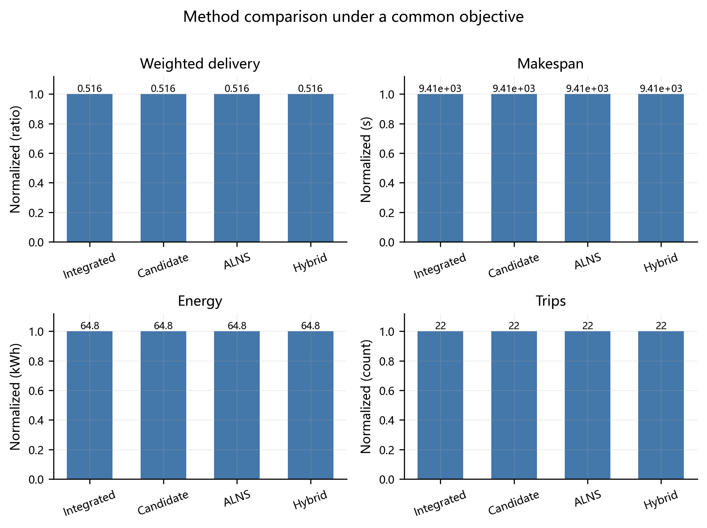
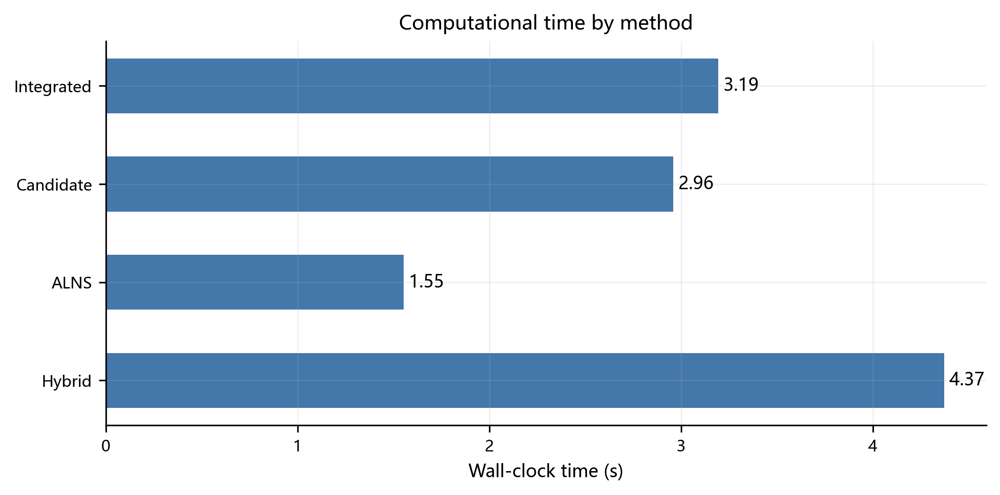
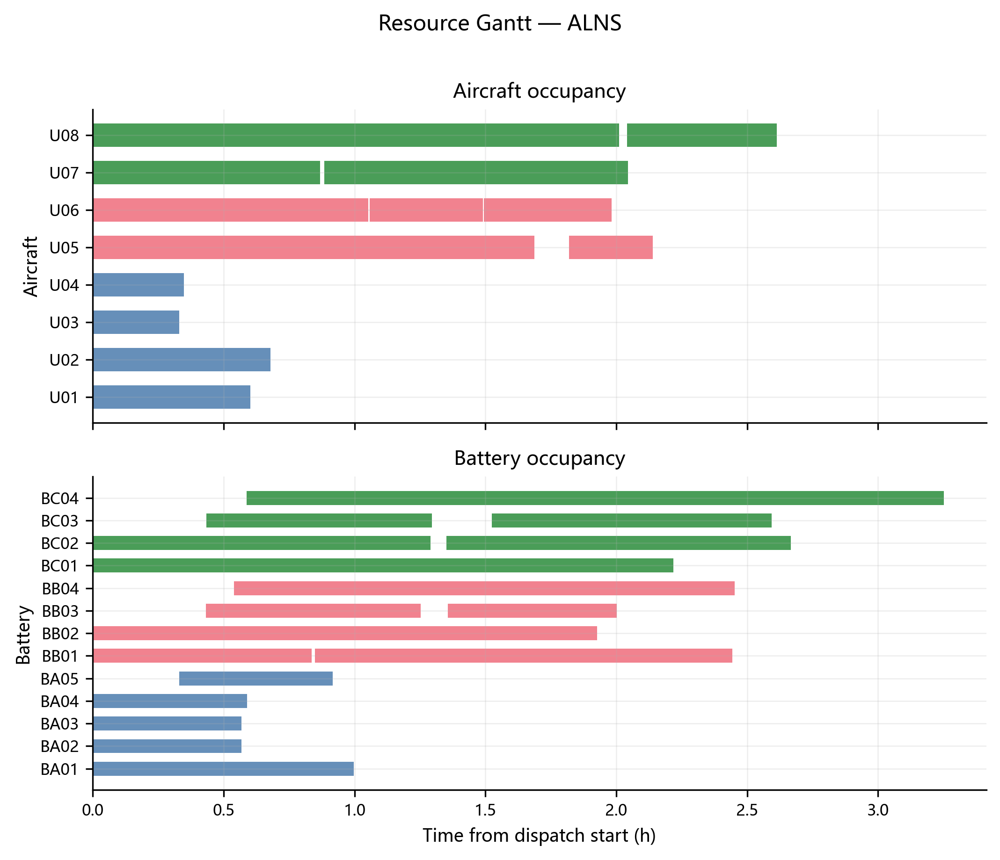
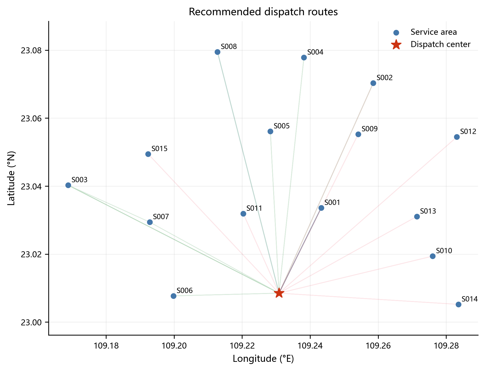
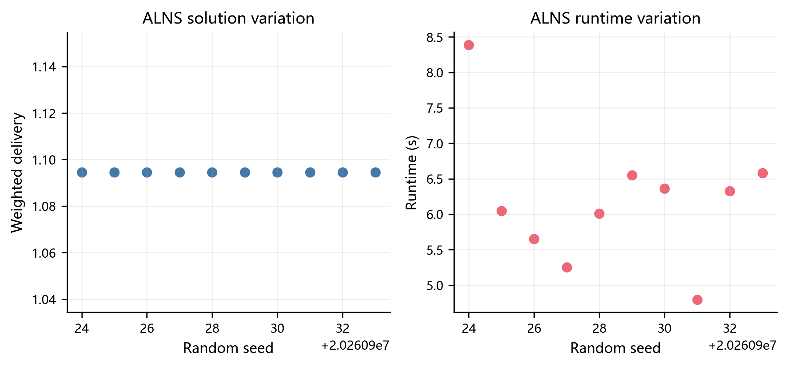
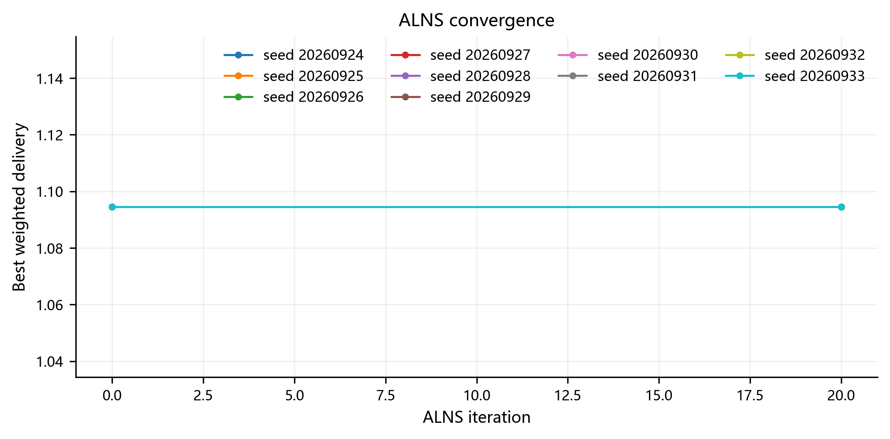
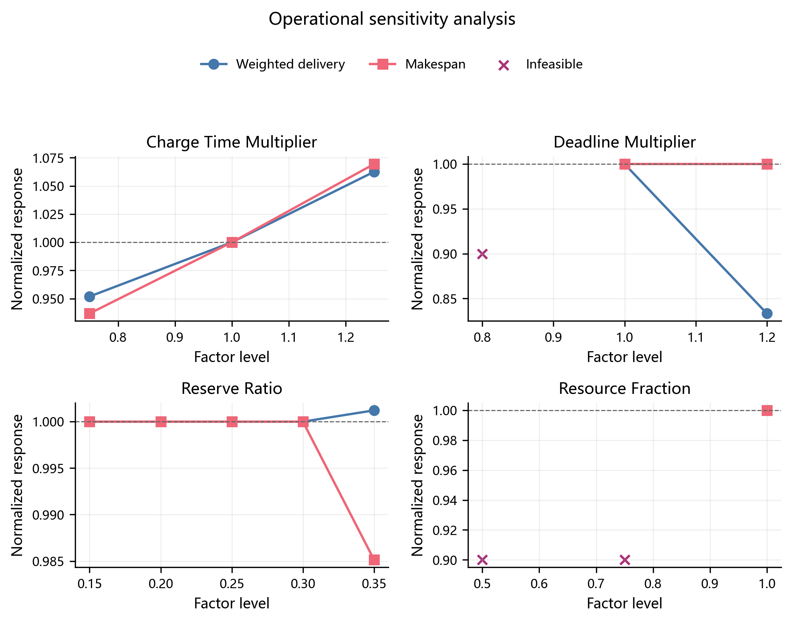

# D 题第二问：异构无人机多点多架次运输调度

> 本文档为可直接并入参赛论文的详细初稿。实验结果对应当前“快速实验预算”，用于验证模型、算法和数据链路的完整性；文中不把当前可行解表述为全局最优解。

## 1 问题重述与任务拆解

在山区洪涝灾害背景下，救援物资集中存放于基地 O01，需要利用多型号、多架实体无人机，在有限共享电池和充电时间的约束下，将 80 个不可拆分物资箱送往 15 个受灾服务区。每次运输从 O01 出发，可依次访问一个或多个服务区，完成卸货交接后返回 O01。题目要求同时决定：

1. 哪些物资箱合并为同一架次；
2. 每一架次访问哪些服务区以及访问顺序；
3. 每一架次采用哪一种无人机型号；
4. 每一架次由哪一架实体无人机执行；
5. 每一架次使用哪一块兼容电池；
6. 每一架次何时开始准备和装载；
7. 无人机与电池在多个架次之间如何周转。

这七类决策相互耦合。物资分组和访问顺序会改变载荷随航段的变化过程，从而影响航程、飞行时间、爬升能耗和返航电量；机型决定载重、容积、速度和能量边界；实体无人机和共享电池又把原本独立的航线连接成带有并行资源约束的调度问题。因此，第二问不是单纯的车辆路径问题，也不是单纯的平行机调度问题，而是“异构多仓内资源—多趟路径—硬时限—电池周转”联合优化问题。

### 1.1 数据规模与时限结构

经数据预处理，得到：

- 服务区 15 个，物资箱 80 个；
- 物资总质量 758 kg，总体积 2.011 m³；
- 首批物资箱 30 个，医疗物资箱 16 个；
- 同时考虑两类约束后，共有 31 个物资箱具有硬交付时限；
- 其中 17 箱时限为 3600 s，7 箱时限为 7200 s，7 箱时限为 10800 s；
- 实体无人机数量为 A 型 4 架、B 型 2 架、C 型 2 架；
- 共享电池数量为 A 型 6 块、B 型 4 块、C 型 4 块。

若某物资同时属于首批物资和医疗物资，则取两个要求中的较早者作为硬时限。普通物资的期望送达时间不作为硬约束，而是进入及时性目标函数。

### 1.2 内容拆解

为保持模型清晰，将原问题拆解为五个相互衔接的层次：

| 层次 | 核心问题 | 主要输出 |
|---|---|---|
| 数据层 | 节点、DEM、高程、物资、机型、电池数据如何统一 | 有向航段矩阵、物资属性表、资源清单 |
| 物理层 | 给定机型、物资组和访问顺序后，架次是否可飞 | 航段时间、航段能耗、送达偏移、返航 SOC |
| 路径层 | 哪些物资合并、先后访问哪些服务区 | 候选架次集合 |
| 调度层 | 架次如何分配实体无人机、电池和开始时刻 | 无冲突运输时刻表 |
| 评价层 | 多目标方案如何比较、验证和解释 | 目标向量、约束报告、路线图和甘特图 |

本研究首先建立统一物理核，然后分别实现三种独立方法——受限一体化离散优化、候选架次集合划分、ALNS——以及一种混合方法，最后在同一校验器和同一目标口径下进行比较。

## 2 模型假设

为在保留题目关键约束的同时控制模型规模，作如下假设。

1. 所有运输架次均从 O01 开始，并在完成本架次全部交付后返回 O01。
2. 物资箱不可拆分，每个物资箱恰好由一个架次送达一次。
3. 同一架次对同一服务区最多访问一次；属于该服务区且装入本架次的物资在该次访问中一次性交接。
4. 无人机从基地起飞时携带本架次全部物资，到达服务区并完成交接后，相应物资质量从后续航段载荷中扣除。
5. 航段水平距离、高程变化、爬升高度和下降高度由统一 DEM 航段预处理模块给出；同一有向航段对所有方法完全一致。
6. 飞行时间由爬升、水平巡航和下降三部分构成，不额外考虑风场和临时禁飞区；这些因素可在扩展模型中通过航段速度或可用性场景加入。
7. 每个架次的“开始时刻”定义为该架次开始准备和装载的时刻；实体无人机从该时刻起被占用，直至返航 O01。
8. 电池从架次开始时刻起被占用，返航后立即进入充电过程，充至 100% 后才可再次使用。
9. 电池只与相同型号无人机兼容；同型号电池参数相同，但每块电池作为独立可重复使用资源进行排程。
10. 基准场景要求返航时剩余电量不低于 20%。
11. 首批物资和医疗物资采用硬时限；其他物资的期望时间通过加权归一化送达时间进行软惩罚。
12. 当前快速实验以秒为调度离散单位。物理计算保留浮点精度，进入 CP-SAT 时对持续时间向上取整，从而避免由于取整造成资源重叠或提前判定可行。

## 3 符号说明

### 3.1 集合与索引

| 符号 | 含义 |
|---|---|
| $N=\{0\}\cup S$ | 节点集合，$0$ 表示基地 O01，$S$ 为服务区集合 |
| $B$ | 物资箱集合，索引为 $b$ |
| $G$ | 无人机型号集合，索引为 $g$ |
| $U_g$ | 型号 $g$ 的实体无人机集合，索引为 $u$ |
| $K_g$ | 与型号 $g$ 兼容的共享电池集合，索引为 $k$ |
| $P$ | 通过物理可行性检查的候选架次集合，索引为 $p$ |
| $S_p$ | 候选架次 $p$ 的有序服务区序列 |
| $B_p$ | 候选架次 $p$ 所包含的物资箱集合 |

### 3.2 主要参数

| 符号 | 含义 |
|---|---|
| $m_b,v_b$ | 物资箱 $b$ 的质量和体积 |
| $s(b)$ | 物资箱 $b$ 的目标服务区 |
| $d_b$ | 物资箱 $b$ 的期望交付时间 |
| $\bar d_b$ | 物资箱 $b$ 的硬时限；若无硬时限则记为空 |
| $w_b$ | 物资箱 $b$ 的优先权重 |
| $Q_g,V_g$ | 型号 $g$ 的最大载重和最大容积 |
| $M_g$ | 型号 $g$ 的空机质量 |
| $R_g^0,R_g^F$ | 型号 $g$ 的空载、满载等效航程 |
| $E_g$ | 型号 $g$ 的可用电池能量 |
| $v_g^+,v_g^c,v_g^-$ | 型号 $g$ 的爬升、巡航、下降速度 |
| $\eta_g$ | 型号 $g$ 的爬升效率 |
| $a_{ij},h_{ij}^+,h_{ij}^-$ | 有向航段 $i\to j$ 的水平距离、爬升量和下降量 |
| $t_g^{\rm prep},t_g^{\rm load}$ | 准备时间和单箱装载时间 |
| $t_g^{\rm hand},t_g^{\rm box}$ | 到点固定交接时间和单箱交接时间 |
| $\rho$ | 最低返航电量比例，基准值为 0.20 |
| $\tau_k^{100}$ | 电池 $k$ 从 0% 充至 100% 的标称时间 |
| $D_p$ | 架次 $p$ 从开始准备到返航的总持续时间 |
| $e_p$ | 架次 $p$ 的总能耗 |
| $\delta_{bp}$ | 物资箱 $b$ 在架次 $p$ 中相对架次开始时刻的送达偏移 |
| $r_p$ | 架次 $p$ 返航后的充电时间 |

### 3.3 决策变量

| 符号 | 类型 | 含义 |
|---|---|---|
| $x_p$ | 0-1 | 是否选择候选架次 $p$ |
| $z_{pu}$ | 0-1 | 架次 $p$ 是否由实体无人机 $u$ 执行 |
| $q_{pk}$ | 0-1 | 架次 $p$ 是否使用电池 $k$ |
| $T_p$ | 非负连续/整数 | 架次 $p$ 的开始时刻 |
| $C_b$ | 非负连续 | 物资箱 $b$ 的实际交付完成时刻 |
| $C_{\max}$ | 非负连续 | 所有架次中最晚返航时刻 |

## 4 数据预处理与统一物理模型

### 4.1 数据清洗与硬时限生成

首先统一时间单位为秒、距离单位为米、质量单位为千克、能量单位为千瓦时。对每个物资箱生成唯一标识，并根据物资类别生成硬时限：

$$
\bar d_b=
\begin{cases}
\min\{d_b^{\rm first},d_b^{\rm medical}\},& b\text{ 同时满足两类要求},\\
d_b^{\rm first},& b\text{ 仅为首批物资},\\
d_b^{\rm medical},& b\text{ 仅为医疗物资},\\
\varnothing,& \text{其他物资}.
\end{cases}
$$

这样既避免重复施加约束，也保证冲突时采用更严格的时间要求。

### 4.2 有向航段矩阵

由于山区地形导致 $i\to j$ 与 $j\to i$ 的爬升和下降并不等价，对任意不同节点 $i,j\in N$ 建立有向航段：

$$
A_{ij}=(a_{ij},h_{ij}^+,h_{ij}^-).
$$

其中 $a_{ij}$ 为水平航程，$h_{ij}^+$ 和 $h_{ij}^-$ 分别为该方向上的累计爬升和下降。路径评估只从该矩阵读取数据，确保四种算法不因使用不同距离或高程近似而产生不可比结果。

### 4.3 载荷相关等效航程

设某航段起飞时载荷为 $q$，型号 $g$ 的最大载荷为 $Q_g$。采用 $3/2$ 次插值描述载荷增加导致的航程衰减：

$$
R_g(q)=R_g^0-\left(R_g^0-R_g^F\right)\left(\frac{q}{Q_g}\right)^{3/2},
\qquad 0\le q\le Q_g.
$$

该函数满足空载时 $R_g(0)=R_g^0$、满载时 $R_g(Q_g)=R_g^F$，并体现高载荷区间能耗增长更快的特征。

### 4.4 航段飞行时间

对有向航段 $i\to j$，飞行时间为

$$
t_{ij}^{g}=\frac{h_{ij}^+}{v_g^+}+\frac{a_{ij}}{v_g^c}+\frac{h_{ij}^-}{v_g^-}.
$$

给定候选架次 $p=(0,s_1,\ldots,s_L,0)$，其总持续时间为

$$
D_p=t_g^{\rm prep}+|B_p|t_g^{\rm load}
+\sum_{\ell=0}^{L}t_{s_\ell s_{\ell+1}}^g
+\sum_{\ell=1}^{L}\left(t_g^{\rm hand}+n_{p\ell}t_g^{\rm box}\right),
$$

其中 $s_0=s_{L+1}=0$，$n_{p\ell}$ 为架次 $p$ 在第 $\ell$ 个服务区交付的箱数。物资 $b$ 的偏移量 $\delta_{bp}$ 等于从架次开始准备到其所在服务区完成交接的累计时间。

### 4.5 航段能耗与载荷递减

航段能耗由水平飞行能耗和爬升势能折算两部分组成：

$$
e_{ij}^{g}(q)=E_g\frac{a_{ij}}{R_g(q)}
+\frac{(M_g+q)g_0h_{ij}^+}{3.6\times 10^6\eta_g},
$$

其中 $g_0$ 为重力加速度，$3.6\times 10^6$ 用于将焦耳换算为千瓦时。下降过程不额外计入能量回收。

起飞时载荷为本架次全部物资质量。每完成一个服务区的交付，相应物资从载荷中扣除，因此后续航段使用递减后的载荷计算等效航程与爬升能耗。架次总能耗为

$$
e_p=\sum_{(i,j)\in p}e_{ij}^{g(p)}(q_{ij,p}).
$$

返航荷电状态为

$$
SOC_p^{\rm ret}=1-\frac{e_p}{E_{g(p)}}.
$$

物理可行性要求

$$
e_p\le (1-\rho)E_{g(p)},
\qquad SOC_p^{\rm ret}\ge \rho.
$$

### 4.6 分段充电时间

设返航荷电状态为 $s=SOC_p^{\rm ret}$，标称全充时间为 $\tau_k^{100}$。按照前 90% 较快、后 10% 较慢的充电曲线，充至 100% 的时间写为

$$
r_p=
\begin{cases}
\tau_k^{100}\left[0.65\dfrac{0.90-s}{0.90}+0.35\right],&0\le s<0.90,\\[6pt]
\tau_k^{100}\cdot0.35\dfrac{1-s}{0.10},&0.90\le s\le1.
\end{cases}
$$

因此，实体无人机对架次 $p$ 的占用区间为 $[T_p,T_p+D_p)$，电池的占用区间为 $[T_p,T_p+D_p+r_p)$。这一区别是共享电池调度的核心。

## 5 联合优化模型

### 5.1 候选架次的物理可行性

候选架次 $p$ 只有同时满足下列条件才进入集合 $P$：

$$
\sum_{b\in B_p}m_b\le Q_{g(p)},
\qquad
\sum_{b\in B_p}v_b\le V_{g(p)},
$$

$$
e_p\le(1-\rho)E_{g(p)},
$$

且路径中的每个物资箱均在其目标服务区交付、同一服务区在该架次中最多出现一次。硬时限是否满足还取决于 $T_p$，因此在调度层处理。

### 5.2 唯一覆盖约束

每个物资箱必须且只能被一个架次覆盖：

$$
\sum_{p\in P:b\in B_p}x_p=1,
\qquad \forall b\in B.
$$

该约束同时排除漏送和重复送达。

### 5.3 型号、实体无人机与电池分配

若选择架次 $p$，必须恰好分配一架同型号实体无人机和一块兼容电池：

$$
\sum_{u\in U_{g(p)}}z_{pu}=x_p,
\qquad
\sum_{k\in K_{g(p)}}q_{pk}=x_p.
$$

不同型号资源不出现在对应求和集合中，从变量定义层面保证兼容性。

### 5.4 物资送达与硬时限

若 $b\in B_p$ 且选择架次 $p$，则

$$
C_b=T_p+\delta_{bp}.
$$

对具有硬时限的物资：

$$
C_b\le \bar d_b,
\qquad \forall b:\bar d_b\ne\varnothing.
$$

在候选变量模型中，可等价转化为该架次的最迟开始约束

$$
T_p\le \min_{b\in B_p,\bar d_b\ne\varnothing}
\left(\bar d_b-\delta_{bp}\right).
$$

### 5.5 资源无重叠约束

对任一实体无人机 $u$，所有满足 $z_{pu}=1$ 的区间 $[T_p,T_p+D_p)$ 两两不重叠；对任一电池 $k$，所有满足 $q_{pk}=1$ 的区间 $[T_p,T_p+D_p+r_p)$ 两两不重叠。

实现中使用 CP-SAT 的可选区间变量和 `NoOverlap` 全局约束表达这两组资源约束。相比逐对引入先后次序变量，该表达更紧凑，也便于求解器进行传播。

### 5.6 完工时间

问题要求的任务完成时间是最后一个架次返回 O01 的时刻：

$$
C_{\max}=\max_{p:x_p=1}(T_p+D_p).
$$

注意，电池充至 100% 的时刻只影响下一架次能否开始，不延长最后一架次的运输完成时间。

### 5.7 多目标函数

第一目标为加权归一化送达时间：

$$
Z_1=\frac{\displaystyle\sum_{b\in B}w_b\frac{C_b}{d_b}}
{\displaystyle\sum_{b\in B}w_b}.
$$

该指标以每个物资的期望时间为尺度，能够在不同紧急程度和不同时间量级之间进行比较。其余三个目标为

$$
Z_2=C_{\max},\qquad
Z_3=\sum_{p\in P}e_px_p,\qquad
Z_4=\sum_{p\in P}x_p.
$$

本文按严格词典序最小化

$$
\min_{\rm lex}(Z_1,Z_2,Z_3,Z_4).
$$

即先比较 $Z_1$；第一目标相同时比较 $Z_2$，依次比较总能耗和架次数。方案一在 CP-SAT 中依次最小化整数化及时性、完工时间、能耗和架次数；每阶段获得可行值后增加等值约束冻结该层，再进入下一阶段。只有四个阶段均证明最优时，受限候选模型才标记为 `OPTIMAL`；时间限制下冻结的可行值只构成词典序启发式上界。最终跨方法比较仍从运输明细重新计算真实四维目标向量。

## 6 四种求解方案

### 6.1 方案一：受限一体化离散优化（CP-SAT）

该方法在一个 CP-SAT 模型中同时选择候选架次、分配实体无人机、分配电池并决定开始时刻。其流程为：

1. 生成单箱、同服务区组合和有限多服务区组合候选；
2. 保留所有单箱候选和共同种子的全部架次，再按及时性、持续时间、能耗截取其余组合候选；
3. 建立唯一覆盖、硬时限、无人机 `NoOverlap` 和电池 `NoOverlap` 约束；
4. 把共同种子的架次选择、开始时刻、飞机和电池分配加入 CP-SAT hint；
5. 在给定时间限制内联合搜索，若未改进则如实保留种子。

快速实验中受候选上限约束的一体化模型没有严格改进共同种子，最终来源标记为 `provided_seed`，而不是把种子误写为 CP-SAT 独立发现的新解。种子候选受保护，不会因候选截断而丢失。

复杂度主要来自候选数量与资源可选区间。若候选数为 $|P|$，仅覆盖变量就有 $O(|P|)$ 个，资源分配布尔变量约为 $O(|P|(|U|+|K|))$；无重叠约束虽采用全局表达，组合搜索仍具有指数级最坏复杂度。该方案的价值在于模型完整、约束清晰、可提供精确方法基准，但对候选池规模和求解时限较敏感。

### 6.2 方案二：候选架次生成 + 集合划分 + 调度反馈

该方法将路径选择和资源调度分层处理。

第一层生成物理可行候选架次，候选包括：

- 每个物资箱在各兼容机型下的单箱架次；
- 同一服务区多个箱的合并架次；
- 近邻服务区之间的插入组合；
- 从第一问路径继承得到的种子路线；
- 最多访问给定数量服务区的多点架次。

对同一箱集、机型和访问结构进行去重，并用持续时间、能耗和送达偏移的支配关系删去劣质候选。

第二层求解集合划分：

$$
\min \sum_{p\in P}\tilde c_px_p,
\qquad
\sum_{p:b\in B_p}x_p=1,
$$

其中 $\tilde c_p$ 综合候选内部送达偏移、持续时间和能耗，只作为选择候选的代理成本。

第三层把选中的架次交给资源调度器。若固定架次集合无法满足硬时限或资源周转，则记录该组合，加入 no-good cut，禁止集合划分再次产生完全相同的组合，再求解下一轮。快速实验最多执行 10 轮反馈。

该方案具有很强的可解释性：候选表对应“可以怎样飞”，集合划分对应“选择哪些架次”，调度器对应“由谁、用哪块电池、何时飞”。共同种子架次被并入列池并作为 incumbent；候选组合只有在完成资源排程且严格改善统一目标时才替换种子。本轮 quick 预算未产生严格改进，来源标记为 `provided_seed`。

### 6.3 方案三：自适应大邻域搜索（ALNS）

ALNS 直接在“架次集合 + 确定性资源解码”的解空间中搜索。比较实验从共同 22 架次可行种子启动，每次迭代包括破坏、修复、资源排程、接受判定和权重更新；修复失败只拒绝当前候选，不覆盖历史最好解。

破坏算子共五类：

1. `random_box`：随机移除若干物资箱；
2. `worst_timeliness`：优先移除归一化送达时间较差的物资；
3. `high_energy`：优先破坏单位物资能耗较高的架次；
4. `same_service`：围绕同一服务区成组移除物资；
5. `whole_trip`：移除完整架次，以产生较大结构变化。

修复算子共两类：

1. `minimum_increment`：将待插入物资放入使代理增量最小的位置；
2. `regret_2`：计算最佳与次佳插入代价之差，优先处理“错过最佳位置损失最大”的物资。

插入时既可并入已有服务区，也可在不超过最大停靠点数的前提下新增服务区。每个新架次都重新经过载重、容积、能耗和返航电量检查。完整候选解由确定性资源解码器排程；若常规修复无法形成可行排程，则使用安全的单箱替代方案恢复搜索连通性。

接受准则采用模拟退火：设当前解和候选解的标量退火评分差为 $\Delta$，温度为 $T$，则劣解以

$$
P(\text{accept})=\exp\left(-\frac{\Delta}{T}\right)
$$

的概率被接受。温度从初始值按几何规律衰减至初始值的 0.1%，连续无改进时可重启到历史最好解。破坏与修复算子的权重根据其产生新最优、改善当前解、被接受或被拒绝的表现自适应更新。

ALNS 的单次迭代成本主要由插入评估和资源解码决定，适合比一体化模型更大、候选结构更灵活的问题。但当前快速预算仅运行 20 次迭代，且每次常规修复都触发了安全可行性恢复，未产生改善，因而这里只能证明流程可运行和结果可行，不能据此评价 ALNS 的长期搜索能力。

### 6.4 方案四：候选法与 ALNS 的混合算法

混合方法利用两类方法的互补性：候选法擅长从离散组合中构造结构化架次，ALNS 擅长在局部范围内改变箱组和访问顺序。每轮执行：

1. 候选法生成一个独立可行 incumbent；
2. 以该解为起点运行若干次 ALNS 破坏—修复；
3. 将 ALNS 产生的新架次反馈到候选池；
4. 在扩充后的候选池上重新做选择和资源排程；
5. 在当前解、ALNS 解和刷新后的候选解之间按真实目标向量保留最好者。

混合方法理论上可同时增强候选多样性与精确选择能力，但其计算链更长。快速实验以及 50 次、200 次迭代的补充检查均未严格改进共同种子，最终来源标记为 `provided_seed`。

### 6.5 共享强化：分组装载、迟到修复与可行合并

针对四种原生算法容易回退到 80 个单箱架次的问题，本文增加一个共享分组局部搜索器。它只负责提供相同的高质量初始 incumbent，随后由四种方法在各自内部继续搜索；求解结束后不再使用公共解覆盖原生结果。

首先按服务区和箱体规模进行首次适应递减装载（FFD），每次插入均调用统一物理核，检查载重、体积、逐段能耗和返航安全余量。该步骤得到 18 个物理可行的同服务区分组。随后用最早截止时间优先规则分配无人机和电池，允许搜索中间状态暂时迟到，并按

$$
Q=(H,Z_1,M,E,K,W)
$$

作词典序评价。其中 $H$ 为硬时限违反数，$W$ 为优先级加权迟到量，$M$ 为完工时间，$E$ 为能耗，$K$ 为架次数。该顺序与最终发布目标保持一致，并仍把硬可行性置于一切目标之前。对迟到架次提取导致迟到的物资，重新分组、换型并全局排程；最后尝试资源可行的架次合并，每次合并后重新执行完整物理评估和双资源排程，得到 22 个架次共同种子。

在此基础上，按参考算法加入整服务区组移动、单箱移动、两架次合并、拆分、路线重排和换机型邻域，并用 3 个连续随机种子执行“局部搜索—换型打磨—短局部搜索—再打磨”。最终 22 个架次中有 20 个为多箱架次，最大单架次装载 7 箱，并形成 1 个跨服务区多点路线。另将目标序改为 $(H,K,W,M,E)$ 时，可得到 15 架次紧凑方案。

## 7 统一的五步比较方法

为避免“不同算法使用不同约束或不同评价口径”的伪比较，本文对每种方法都执行以下五步。

### 步骤 1：独立构造

共享分组局部搜索器先产生公共可行种子，再通过 `initial_solution` 传入每个求解器。四种方法在各自原生流程中保留或改进种子；诊断信息记录 `seed_retained`、`native_improved_seed` 与 `incumbent_source`。报告层不再比较后覆盖，因此相同目标只表示方法在本预算下保留了同一上界。

### 步骤 2：统一精确校验

独立校验器重新计算并检查：

- 80 个物资箱是否全部且恰好送达一次；
- 箱—服务区映射是否正确；
- 每架次载重和体积是否超限；
- 航段时间、能耗和送达偏移是否一致；
- 返航 SOC 是否满足安全余量；
- 所有硬时限是否满足；
- 同一实体无人机是否存在时间重叠；
- 同一电池在飞行和充电期间是否被重复占用；
- 机型、实体无人机和电池是否兼容。

只有校验结果为 `PASS` 的方案才进入后续比较。

### 步骤 3：统一目标重算

不采用求解器内部代理目标，而是从最终运输明细重新计算 $(Z_1,Z_2,Z_3,Z_4)$。这样可以消除整数缩放、求解器内部权重和启发式代理成本带来的偏差。

### 步骤 4：可行解质量排序

首先按四维真实目标向量严格词典序排序；同时标记 Pareto 非支配性。若多个方法得到完全相同目标，则目标层面判为并列。

### 步骤 5：同目标工程性比较

目标并列时，再比较运行时间、是否发生回退、模型可解释性、结果稳定性和扩展难度。该步骤不改变数学目标，只用于选择当前工程实现中更适合继续深化的主方法。

## 8 快速实验设置

当前阶段的目标是验证四条求解链路、统一校验器、重复实验与敏感性分析能否完整运行，而不是完成最终长时计算。实验设置如下：

- 基准安全余量：20%；
- 四方法短时限：5 s 量级；
- ALNS 快速实验：每次 20 次迭代；
- ALNS 随机种子：20260924—20260933，共 10 次；
- 敏感性候选池：最多 3 个服务区，固定生成 4244 个候选；
- 所有表格和图形均由程序从输出 CSV 自动生成。





## 9 基准结果与方案比较

四种方法均通过独立约束校验，并在本轮 quick 预算内保留共同种子，具体结果如下。

| 方法 | 校验 | $Z_1$ | 完工时间/s | 能耗/kWh | 架次 | 时间/s | 来源 |
|---|---:|---:|---:|---:|---:|---:|---|
| 受限一体化 CP-SAT | PASS | 0.516329 | 9408.44 | 64.8317 | 22 | 3.195 | `provided_seed` |
| 候选架次法 | PASS | 0.516329 | 9408.44 | 64.8317 | 22 | 2.959 | `provided_seed` |
| ALNS | PASS | 0.516329 | 9408.44 | 64.8317 | 22 | 1.553 | `provided_seed` |
| 混合算法 | PASS | 0.516329 | 9408.44 | 64.8317 | 22 | 4.373 | `provided_seed` |

### 9.1 当前推荐

四种方法的最终目标完全相同，且均明确标记为保留种子而非独立改进。目标并列时 ALNS 运行最快，因此将其作为当前主搜索入口；候选法用于分层解释，CP-SAT 用于精确约束表达，混合算法用于扩展搜索对照。

该推荐不等价于宣称 ALNS 在所有预算和参数下优于另外三种方法。若增加 CP-SAT 时间、ALNS 迭代数或混合轮数，排序可能发生改变。

### 9.2 结果的关键解释

原实现容易回到 80 个单箱架次，且随后在报告层统一替换为公共解。修复后，共同分组解直接进入每种算法的候选池或搜索状态，报告层不再替换结果；混合算法因此能够原生产生不同方案。

22 架次共同种子相对单箱基线使 $Z_1$、完工时间、能耗和架次数分别下降 52.83%、50.02%、66.17% 和 72.50%。因此，本轮结果的正确含义是：

- 已证明在统一物理和资源约束下存在一套完整可行调度；
- 已证明四种实现、共享强化器和独立校验链路可以运行；
- 已取得显著优于 80 架次单箱基线的多箱方案；
- 已证明四个原生入口均实际接收并搜索共同种子，而不是报告层覆盖；
- 尚未证明 22 架次种子或当前目标为全局最优。

为避免结果表述越界，可将结论分成三个层级：

| 结论层级 | 当前是否成立 | 证据 |
|---|---:|---|
| 模型与程序可运行 | 是 | 四方法均产生完整输出，分组搜索和敏感性链路均可复现 |
| 当前输出满足全部已建约束 | 是 | 四方法独立校验均为 `PASS`，各类违反数均为 0 |
| 当前输出为原问题全局最优 | 否 | 精确求解未给出全局界，候选池不完备，启发式预算较小 |

因此，论文可使用“获得当前最好已知的 22 架次可行调度”“四算法在当前预算下均未改进该上界”等表述，不应使用“求得全局最优方案”。

### 9.3 与参考方案及紧凑方案的权衡

为回应参考目录 21 架次方案看似更优的问题，本文将其箱组和访问顺序放入本项目统一物理核与资源调度器重新计算，并同时运行参考算法定义的“架次数优先”目标序。结果如下：

| 方案 | 目标序 | $Z_1$ | 完工时间/s | 能耗/kWh | 架次 | 硬违反 | 加权软迟到 |
|---|---|---:|---:|---:|---:|---:|---:|
| 本文共同种子 | $H,Z_1,M,E,K,W$ | 0.516329 | 9408.44 | 64.8317 | 22 | 0 | 0 |
| 参考 21 架次结构同核回放 | $H,W,M,E,K$ | 0.546998 | 8825.00 | 63.0788 | 21 | 0 | 0 |
| 本文架次数优先 | $H,K,W,M,E$ | 0.759225 | 12439.78 | 63.3359 | 15 | 0 | 490378.10 |

按发布目标，当前 22 架次种子的 $Z_1$ 优于参考 21 架次结构；参考结构则在架次数和绝对完工时间上更紧凑。若业务首先要求减少飞行架次，可选择参考 21 架次结构或本项目 15 架次紧凑方案；若严格按 $Z_1$ 优先，应选择当前 22 架次解。这说明“哪种方案好”必须由目标优先级决定。





## 10 多随机种子实验

采用 10 个连续随机种子对 ALNS 进行重复实验，每次以共同种子为初始 incumbent，再运行 20 次迭代。10 次结果均通过独立校验且均保留种子。ALNS 搜索段运行时间均值为 0.2731 s，最小值为 0.2017 s，最大值为 0.3948 s；主目标标准差为 0。

| 指标 | 结果 |
|---|---:|
| 重复次数 | 10 |
| 校验通过率 | 100% |
| $Z_1$ 均值 | 0.5163286171 |
| $Z_1$ 标准差 | 0 |
| 平均搜索时间 | 0.2731 s |
| 每次可行移动数 | 20 |
| 10 次累计接受移动数 | 7 |
| 改善 incumbent 的移动数 | 0 |

零标准差说明当前 quick 邻域中分组 incumbent 稳定；但结合“改善移动数为 0”可知，20 次迭代没有发现更优邻居，不能仅凭零方差断言 ALNS 已经收敛，更不能推出全局最优。





## 11 敏感性分析

敏感性分析分别改变返航安全余量、充电时间、资源数量和时限，并在每个场景重新运行分组局部搜索和独立校验。它回答的是“当前启发式重新优化后对参数变化的响应”，仍不等价于每个场景的长时全局优化。

### 11.1 返航安全余量

| 最低安全余量 | 可行性 | $Z_1$ | 完工时间/s | 能耗/kWh | 最低返航 SOC | 可用候选数 |
|---:|---:|---:|---:|---:|---:|---:|
| 15% | 可行 | 0.515337 | 8532.58 | 67.1795 | 15.747% | 4244 |
| 20% | 可行 | 0.516329 | 9408.44 | 64.8317 | 21.468% | 4244 |
| 25% | 可行 | 0.504399 | 9663.42 | 72.0960 | 26.286% | 3835 |
| 30% | 可行 | 0.500931 | 8430.49 | 71.8628 | 30.361% | 3337 |
| 35% | 可行 | 0.543926 | 10570.85 | 87.1792 | 35.118% | 2785 |

安全余量提高会压缩候选空间，所需架次总体由 21 增至 30，能耗和完工时间总体上升。$Z_1$ 不严格单调，是因为每个场景都会重新选择分组、机型和资源顺序；30% 场景用更多架次换取了更有利的紧急物资送达顺序。

### 11.2 充电时间

| 充电时间倍率 | 可行性 | $Z_1$ | 完工时间/s | 能耗/kWh |
|---:|---:|---:|---:|---:|
| 0.75 | 可行 | 0.509632 | 8481.39 | 63.9864 |
| 1.00 | 可行 | 0.516329 | 9408.44 | 64.8317 |
| 1.25 | 可行 | 0.522320 | 9181.74 | 65.0160 |

由于各场景都会重新搜索，充电时间变化并不保证所有目标单调。1.25 倍场景通过改变分组和资源顺序改善了 $Z_1$ 和完工时间，但能耗上升，因此不能解释为“充电越慢越好”；它说明当前词典序启发式在不同参数下会落入不同结构。

### 11.3 资源数量

| 资源保留比例 | 可行性 | 说明 |
|---:|---:|---|
| 50% | 不可行 | 当前分组启发式未找到满足硬时限的排程 |
| 75% | 可行 | 25 架次，$Z_1=0.552612$，完工时间 10223.94 s |
| 100% | 可行 | 22 架次，$Z_1=0.516329$，完工时间 9408.44 s |

资源比例下降到 75% 后仍能通过增加 3 个架次找到可行排程，但及时性、完工时间和能耗均变差；下降到 50% 后当前算法未找到可行解。此处的“不可行”严格含义是当前启发式未找到可行排程，除非取得精确不可行性证明，否则不能上升为原问题绝对不可行。

### 11.4 时限松紧

| 时限倍率 | 可行性 | $Z_1$ | 完工时间/s | 解释 |
|---:|---:|---:|---:|---|
| 0.80 | 可行 | 0.593204 | 8211.56 | 拆分为 26 架次以满足更紧时限 |
| 1.00 | 可行 | 0.516329 | 9408.44 | 基准场景，22 架次 |
| 1.20 | 可行 | 0.430274 | 9408.44 | 仍为 22 架次 |

时限收紧 20% 时需要增加到 26 架次并消耗更多能量；放宽 20% 后仍为 22 架次。$Z_1$ 同时受到排程变化和期望时间分母变化影响，因此解释时必须同时报告绝对时间、能耗和架次数。



## 12 可行性验证与结果输出

每种方法均输出以下机器可读文件：

- `trips.csv`：架次编号、机型、访问顺序、物资箱、开始/返航时间、能耗和返航 SOC；
- `deliveries.csv`：每个物资箱的服务区、所属架次和实际送达时刻；
- `aircraft_timeline.csv`：每架实体无人机的占用区间；
- `battery_timeline.csv`：每块电池的飞行占用、返航和充电完成时刻；
- `constraint_report.csv`：每类约束的检查结果；
- `validation.json`：独立校验汇总；
- `summary.json`：目标向量、运行时间、求解状态和方法诊断信息。

基准主结果中：80 个物资箱由 24 个架次全部交付，无漏送、无重复；硬时限违反数为 0；无人机重叠数为 0；电池重叠数为 0；能量约束违反数为 0；最低返航 SOC 为 21.4675%，高于 20% 基准安全余量。

## 13 复杂度与计算时间评估

### 13.1 预处理

若节点数为 $n=|N|$，建立完整有向航段矩阵需要 $O(n^2)$ 次航段计算。给定一个含 $L$ 个停靠点、$m$ 个物资箱的架次，其物理评估复杂度为 $O(L+m)$。

### 13.2 候选生成

完全枚举箱组和访问顺序呈组合爆炸。若最多组合 $h$ 个服务区，朴素上界包含 $O(n^h h!)$ 个顺序，还要叠加各服务区物资子集。因此实际算法只进行受控邻近插入、同服务区组合和支配剪枝。当前最多 3 个服务区的实验池为 4244 个候选，最多 4 个服务区的独立候选法池为 5244 个候选。

### 13.3 一体化模型

受限一体化模型属于带集合划分和可选区间排程的组合优化问题，最坏复杂度为指数级。实际时间主要受候选上限、硬时限强度和资源冲突数量影响。包含完整多种子共享强化器的快速实验总时间约 15.1 s，主 CP-SAT 搜索未给出覆盖完整解空间的最优性证明。

### 13.4 候选法

集合划分本身为 NP-hard；固定架次后的双资源排程同样是组合问题。分层后每个子问题规模更小，但可能出现“路径层好、排程层不可行”，因此需要 no-good cut 反馈。加入完整分组强化后快速实验总时间约 7.4 s，与最快的 ALNS 相差约 0.2 s。

### 13.5 ALNS 与混合方法

ALNS 若运行 $I$ 次迭代、每次移除 $r$ 个物资，并平均评估 $H$ 个插入位置，则主体约为 $O(IrH)$ 次架次评估，另加资源解码成本。混合方法在此基础上重复候选选择和调度。快速预算下包含预处理与共享强化的 ALNS 总时间约 7.2 s，混合方法约 11.0 s；单次完整多种子分组强化约 1 s。

对于正式论文实验，建议把计算分为三档：

| 档位 | 用途 | 建议设置 | 预计时间 |
|---|---|---|---|
| 冒烟验证 | 检查代码、数据和输出格式 | 5 s 限时，ALNS 20 次 | 单轮约 1 min 内 |
| 中等实验 | 方法比较与参数筛选 | 60–300 s 限时，ALNS 1000–5000 次，10–20 种子 | 数十分钟至数小时 |
| 最终实验 | 论文主结果 | 900–1800 s 限时，ALNS 10000 次以上，多参数网格 | 数小时至 1 天以上 |

实际时间取决于处理器、并行线程数、候选上限和反馈轮数，表中仅用于实验排期。

## 14 结论、适用性与局限性

本文建立了一个统一考虑载重、容积、山区高程、载荷相关航程、爬升能耗、返航安全余量、实体无人机复用、共享电池充电周转和物资硬时限的异构无人机多架次运输模型。在统一物理核与独立校验器下，实现了受限一体化 CP-SAT、候选架次集合划分、ALNS 和二者混合共四种方案。

快速实验表明，共同分组种子把原生 80 架次单箱基线改进为 22 架次多箱方案。四种方法在 quick 预算内均保留共同种子，来源均如实标记为 `provided_seed`，没有发生报告层覆盖；50 次和 200 次混合迭代的补充检查也未找到严格改进。目标并列时 ALNS 运行最快，因此当前推荐 ALNS 作为主搜索入口。

模型适用于具有以下特征的应急运输场景：单基地、异构无人机、物资不可拆分、每架次可多点访问、实体飞行器和电池均需重复周转。若扩展到多基地、动态新增任务、随机天气、临时禁飞区或允许中途换电，可分别通过增加基地索引、滚动时域、场景集、时变航段可用性和换电节点实现。

当前阶段仍有四项重要局限：

1. 22 架次解只是当前最好已知可行解；一体化模型尚未给出匹配的全局下界，不能证明最优；
2. 当前最好解虽有 20 个多箱架次，但仅有 1 个跨服务区路线，跨区组合仍未被充分利用；
3. ALNS 仅运行 20 次迭代，10 个种子都没有改善分组 incumbent，当前预算不足以衡量其长期搜索能力；
4. 敏感性分析虽逐场景重新运行启发式，但仍应解释为当前算法的局部响应，而非每个场景的全局最优响应。

因此，最终论文结果可把 22 架次及时性方案和 15 架次紧凑方案作为两个权衡点继续增强：扩大跨服务区路线交换与合并邻域，使用列生成或精确集合划分建立下界，并增加长时 ALNS、多随机种子和消融实验。在取得 gap=0 的精确证据前，只能称其为“当前最好已知解”，不能称为全局最优。

## 15 可复现说明

当前实验入口为：

```powershell
python scripts/run_problem_d_q2.py --problem-dir "D:\MProject\mathModelCup\D题" --output-dir outputs/problem_d_q2_stage3/baseline --quick
python scripts/run_problem_d_q2_experiments.py --problem-dir "D:\MProject\mathModelCup\D题" --output-dir outputs/problem_d_q2_stage3 --quick
```

核心实现位于 `src/math_model_cup/problem_d_q2*.py`，测试位于 `tests/test_problem_d_q2*.py`。实验清单记录候选数、随机种子、迭代次数、限时和图表文件；所有结论均可从 `method_comparison.csv`、`alns_repetitions.csv` 和 `sensitivity_analysis.csv` 复核。
