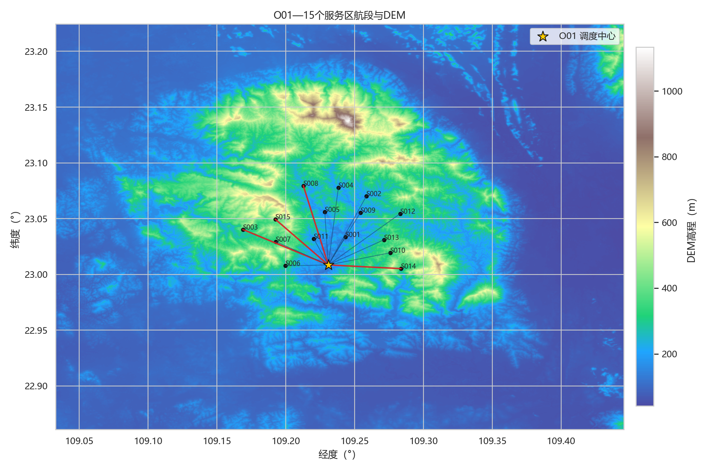
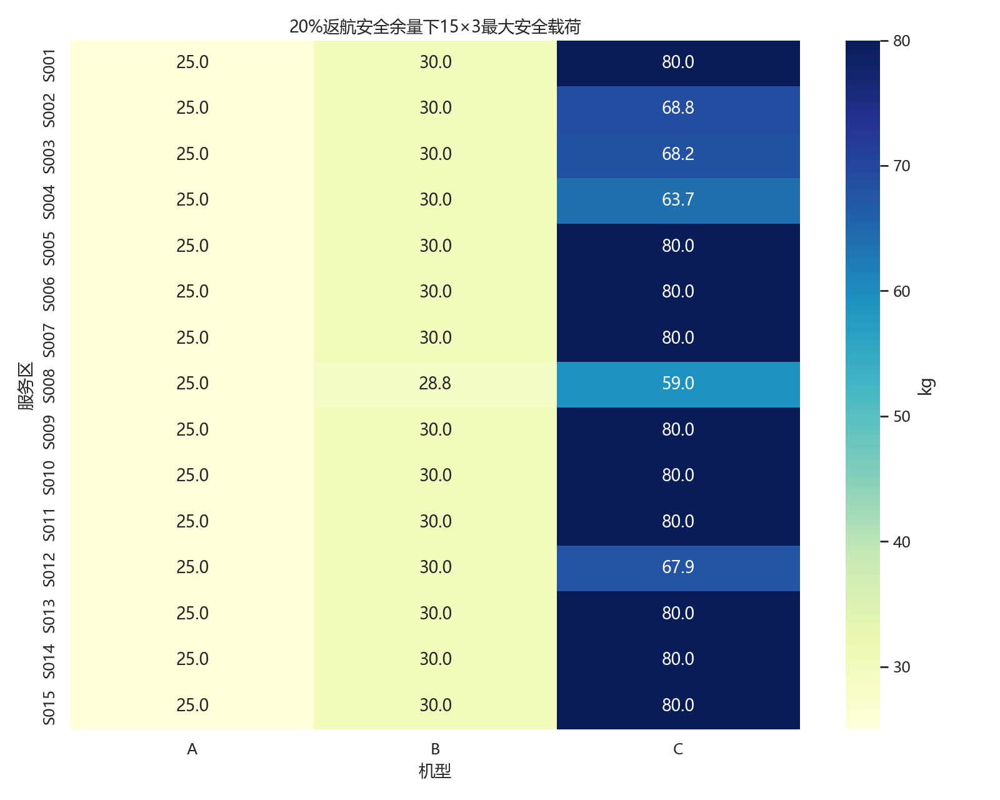
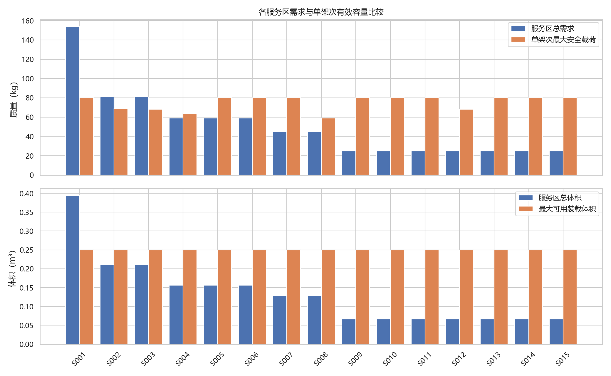
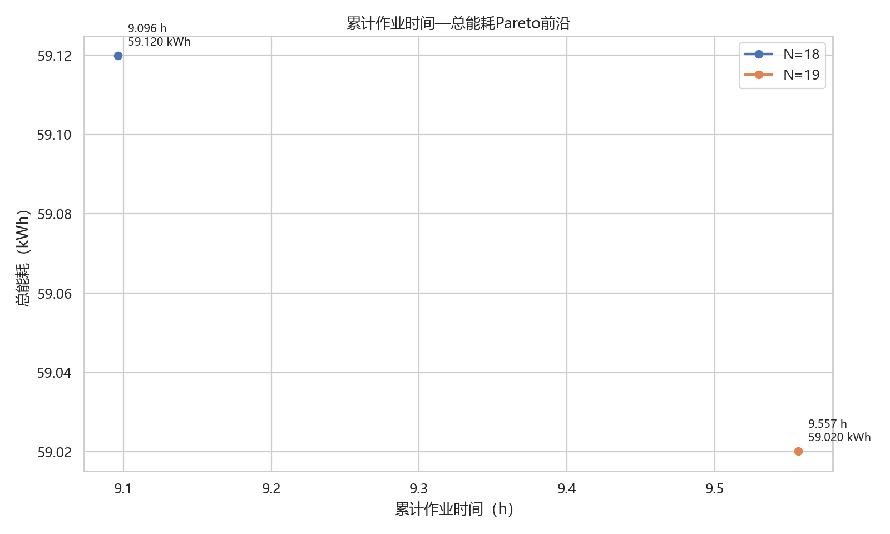
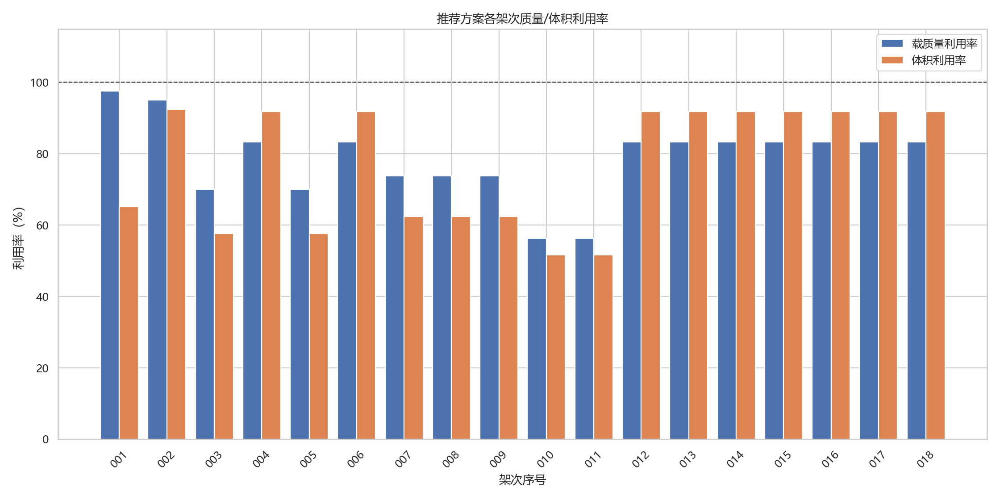
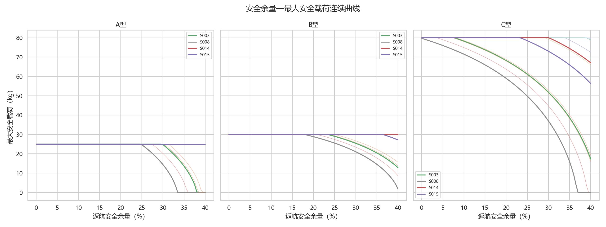
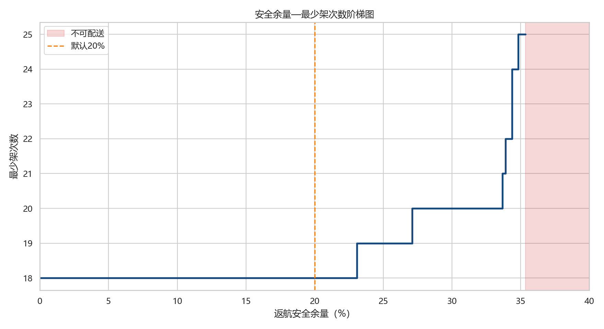

# D题第一问：单点直达运输组批优化

## 1. 问题一模型假设

1. 每架次由 O01 直达一个服务区，完成交付后空载返航，不跨服务区混装。
2. 运输无人机表中的空载质量已经包含电池；去程爬升质量为 $m_0+q$，返程爬升质量为 $m_0$。
3. 服务区作业高度为地面海拔加 30 m；巡航海拔为航段 all-touched DEM 最高高程加 50 m。
4. 水平阶段保持计划巡航速度；爬升、下降分别使用表中最大速度计算作业时间。
5. 参数表下降能耗效率为 0，按题意取下降附加能耗为 0；不计风、温度和悬停扰动。
6. 同物资类型货箱的质量和体积一致，货箱不可拆分，每箱恰好配送一次。
7. 默认返航安全余量为 20%，可行条件在数值容差内按闭区间处理。

## 2. 符号表

| 符号 | 含义 | 单位 |
| --- | --- | --- |
| $i,k$ | 服务区、机型索引 | — |
| $b$ | 货箱索引 | — |
| $d_i$ | O01 到服务区 $i$ 的 WGS84 椭球水平距离 | m |
| $H_i$ | 航段严格 all-touched DEM 最高高程 | m |
| $h_i^O,h_i^S$ | O01 去程、服务区返程爬升高度 | m |
| $m_k^0$ | 含电池空载总质量 | kg |
| $Q_k,V_k$ | 最大载质量、装载体积 | kg, m³ |
| $E_k^{use}$ | 电池可用能量 | kWh |
| $L_k(q)$ | 载荷 $q$ 下的等效航程 | m |
| $E_{RT,ik}(q)$ | 往返总能耗 | kWh |
| $\rho$ | 返航安全余量 | — |
| $x_{ikr}$ | 服务区 $i$ 采用机型 $k$ 的候选组批 $r$ 的次数 | 次 |

## 3. 航段、时间与能耗模型

### 3.1 严格 GIS 航段模型

将经纬度端点变换到 DEM 连续像元坐标，对包围盒内每个像元做闭线段—闭矩形 Liang–Barsky 相交判定；凡边、角或内部被航段接触的像元均计入。距离用 WGS84 椭球反解计算。巡航海拔与四段垂直高度为

$$H_i^c=\max_{p\in\mathcal P_i} z_p+50,$$
$$h_i^O=H_i^c-z_O,\quad h_i^S=H_i^c-(z_i+30).$$

去程下降与返程爬升均为 $h_i^S$，返程下降为 $h_i^O$。

重点航段复核：

| 服务区编号 | WGS84椭球水平距离（m） | Haversine水平距离（m） | 距离差（m） | 严格all_touched最高DEM（m） | 旧密集采样最高DEM（m） | 最高高程差（m） | 最高像元行 | 最高像元列 | 最高像元经度 | 最高像元纬度 | 计划巡航海拔（m） | 去程爬升（m） | 去程下降（m） | 返程爬升（m） | 返程下降（m） |
| --- | --- | --- | --- | --- | --- | --- | --- | --- | --- | --- | --- | --- | --- | --- | --- |
| S003 | 7263.179257 | 7261.075570 | 2.103686 | 511.804138 | 511.804138 | 0.000000 | 726 | 610 | 109.202361 | 23.022917 | 561.804138 | 434.104138 | 223.304138 | 223.304138 | 434.104138 |
| S008 | 8079.033112 | 8109.473185 | -30.440073 | 317.558868 | 317.558868 | 0.000000 | 610 | 670 | 109.219028 | 23.055139 | 367.558868 | 239.858868 | 96.658868 | 96.658868 | 239.858868 |
| S014 | 5419.601858 | 5410.917094 | 8.684764 | 525.543823 | 525.543823 | 0.000000 | 788 | 878 | 109.276806 | 23.005694 | 575.543823 | 447.843823 | 224.543823 | 224.543823 | 447.843823 |
| S015 | 6009.382972 | 6019.113949 | -9.730977 | 521.799255 | 521.799255 | 0.000000 | 666 | 608 | 109.201806 | 23.039583 | 571.799255 | 444.099255 | 97.299255 | 97.299255 | 444.099255 |

### 3.2 时间模型

单架次累计作业时间由固定准备、逐箱装载、去返程爬升/巡航/下降、基础交接和逐箱交接构成：

$$T_{ikr}=t_k^{pre}+n_r t_k^{load}+\frac{h_i^O}{v_k^{up}}+\frac{d_i}{v_k}+\frac{h_i^S}{v_k^{down}}+t_k^{handoff}+n_r t_k^{add}+\frac{h_i^S}{v_k^{up}}+\frac{d_i}{v_k}+\frac{h_i^O}{v_k^{down}}.$$

### 3.3 能耗与安全载荷模型

$$L_k(q)=L_k^0-(L_k^0-L_k^Q)(q/Q_k)^{1.5},$$
$$E_{hor}=E_k^{use}d_i/L_k(q),\qquad E_{up}=(m_k^0+q)gh/(3.6\times10^6\eta_k).$$

往返时去程带货、返程 $q=0$，下降能耗为 0。安全载荷 $q_{ik}^{safe}(\rho)$ 是

$$E_{RT,ik}(q)\le(1-\rho)E_k^{use},\quad 0\le q\le Q_k$$

的最大根，采用单调二分求解。

## 4. 货箱组批优化模型

对每个服务区枚举不超过需求量的整数组合 $a_{ibr}$，筛除质量、体积和能量不可行组合。集合划分模型为

$$\min\left(\sum_{ikr}x_{ikr},\ \sum_{ikr}T_{ikr}x_{ikr},\ \sum_{ikr}E_{ikr}x_{ikr}\right),$$
$$\sum_{kr}a_{ibr}x_{ikr}=D_{ib},\quad x_{ikr}\in\mathbb Z_+.$$

目标按“架次数—累计作业时间—总能耗”词典序处理；另保留三目标非支配状态以构造 Pareto 前沿。

## 5. 三种算法与伪代码

### 5.1 BFD+合并改进

```text
按质量与体积递减排列货箱
for 每个货箱:
    放入可行且剩余容量最小的已有架次，否则新建架次
while 存在可行的两架次合并:
    选择时间最短、能耗最低的合并
对每个组批替换为时间—能耗更优机型
```

该方法只包含最佳适应递减与两架次合并，因此准确命名为“BFD+合并改进”，不称为局部搜索。

### 5.2 词典序动态规划

```text
state = 各物资类型已配送箱数
F(target) = (0, 0, 0)
F(state) = lexicographic_min over feasible batch r:
           (1, T_r, E_r) + F(state + a_r)
```

### 5.3 集合划分 MILP

先最小化总架次数并固定最优值，再最小化时间并固定最优值，最后最小化能耗；三阶段共享精确覆盖约束。

### 5.4 多目标 Pareto 动态规划

```text
for 每个计数状态:
    生成所有可达 (N,T,E,路径)
    删除被另一状态在 N、T、E 三维同时不劣且至少一维更优的状态
对15个服务区前沿逐次卷积并继续非支配筛选
```

## 6. 多目标优化与最终优先级

| 场景 | 架次数上限 | 实际架次数 | 累计作业时间（h） | 总能耗（kWh） |
| --- | --- | --- | --- | --- |
| 架次数最少锚点 | 不限制 | 18 | 9.096231 | 59.119904 |
| 总能耗最少锚点 | 不限制 | 19 | 9.556758 | 59.020116 |
| 累计作业时间最少锚点 | 不限制 | 18 | 9.096231 | 59.119904 |
| N≤18时最低能耗 | 18 | 18 | 9.096231 | 59.119904 |
| N≤18时最短时间 | 18 | 18 | 9.096231 | 59.119904 |
| N≤19时最低能耗 | 19 | 19 | 9.556758 | 59.020116 |
| N≤19时最短时间 | 19 | 18 | 9.096231 | 59.119904 |
| N≤20时最低能耗 | 20 | 19 | 9.556758 | 59.020116 |
| N≤20时最短时间 | 20 | 18 | 9.096231 | 59.119904 |

固定最少架次数 $N=18$ 时，时间—能耗前沿只有一个点。允许增加到 19 架次，最低能耗从 59.119904 kWh 降到 59.020116 kWh，仅节能 0.099788 kWh（0.169%），但累计时间增加约 0.460527 h；20 架次没有新增非支配收益。因此应急场景采用“先最少架次数、再最短累计作业时间、最后最低能耗”的优先级有结果支撑。

## 7. 结果分析

### 7.1 三算法比较

| 方法 | 架次数 | 总能耗（kWh） | 累计作业时间（h） | A型架次 | B型架次 | C型架次 | 平均载质量利用率（%） | 平均体积利用率（%） | 架次数最优差距（%） | 时间差距（%） | 能耗差距（%） | 运行时间（s） |
| --- | --- | --- | --- | --- | --- | --- | --- | --- | --- | --- | --- | --- |
| BFD+合并改进 | 18 | 59.530638 | 9.099564 | 0 | 9 | 9 | 76.134259 | 76.748250 | 0.000000 | 0.036645 | 0.694747 | 0.015514 |
| 词典序动态规划 | 18 | 59.119904 | 9.096231 | 0 | 9 | 9 | 78.680556 | 77.179300 | 0.000000 | 0.000000 | 0.000000 | 0.109949 |
| 集合划分 MILP | 18 | 59.119904 | 9.096231 | 0 | 9 | 9 | 78.680556 | 77.179300 | 0.000000 | 0.000000 | 0.000000 | 0.111608 |

推荐方案为 18 架次，B 型 9 架次、C 型 9 架次、A 型 0 架次，总能耗 59.119904 kWh，累计作业时间 9.096231 h，最低返航 SOC 为 23.088350%。DP 与 MILP 的目标值完全一致；BFD+合并改进也达到 18 架次，但时间和能耗略高。

### 7.2 严格 GIS 前后差异

旧密集采样+Haversine 结果为 59.229738 kWh、9.102476 h；严格 GIS 后为 59.119904 kWh、9.096231 h。两者均为 18 架次、B/C 各 9 架次，组批结构不变。15 条航段的椭球距离与 Haversine 距离最大绝对差为 30.965992 m，严格 all-touched 与旧密集采样的沿线最高 DEM 高程最大差为 0.000000 m，45 个“服务区—机型”安全载荷的最大绝对差为 0.468728 kg。

### 7.3 两种能耗解释

| 能耗解释 | 算法 | 架次数 | B型架次 | C型架次 | 累计作业时间（h） | 总能耗（kWh） | 最低返航SOC（%） | 组批与主口径相同 |
| --- | --- | --- | --- | --- | --- | --- | --- | --- |
| 主口径：标准航程消耗100%可用能量 | 词典序动态规划 | 18 | 9 | 9 | 9.096231 | 59.119904 | 23.088350 | True |
| 主口径：标准航程消耗100%可用能量 | 集合划分 MILP | 18 | 9 | 9 | 9.096231 | 59.119904 | 23.088350 | False |
| 备选：标准航程已预留20%电量 | 词典序动态规划 | 18 | 9 | 9 | 9.096231 | 47.804792 | 38.028329 | True |
| 备选：标准航程已预留20%电量 | 集合划分 MILP | 18 | 9 | 9 | 9.096231 | 47.804792 | 38.028329 | False |

两种解释的架次数与机型构成一致，说明结构结论稳健；能耗和返航 SOC 数值依赖标定口径。

### 7.4 独立代表架次复核

| 复核类别 | 架次编号 | 服务区 | 机型 | 箱数 | 质量（kg） | 体积（m³） | 去程等效航程（m） | 返程等效航程（m） | 去程水平能耗（kWh） | 返程水平能耗（kWh） | 去程爬升能耗（kWh） | 返程爬升能耗（kWh） | 下降附加能耗（kWh） | 总能耗（kWh） | 飞行时间（s） | 地面作业时间（s） | 总时间（s） | 返航SOC（%） | 能耗误差（kWh） | 时间误差（s） | 约束通过 |
| --- | --- | --- | --- | --- | --- | --- | --- | --- | --- | --- | --- | --- | --- | --- | --- | --- | --- | --- | --- | --- | --- |
| S001近距离重载架次 | Q1-DP-001 | S001 | C | 6 | 78.000000 | 0.163000 | 12521.704948 | 26000.000000 | 1.951158 | 0.939686 | 0.081365 | 0.023560 | 0.000000 | 2.995769 | 618.169077 | 876.000000 | 1494.169077 | 62.552884 | 0.000000 | 0.000000 | True |
| S003或S008远距离重载架次 | Q1-DP-005 | S003 | C | 5 | 56.000000 | 0.144000 | 17800.731740 | 26000.000000 | 3.264216 | 2.234824 | 0.206849 | 0.059076 | 0.000000 | 5.764965 | 1560.091350 | 810.000000 | 2370.091350 | 27.937936 | 0.000000 | 0.000000 | True |
| B型25kg架次 | Q1-DP-004 | S002 | B | 3 | 25.000000 | 0.067000 | 18871.290708 | 28000.000000 | 1.570918 | 1.058759 | 0.062511 | 0.022563 | 0.000000 | 2.714750 | 1190.014576 | 630.000000 | 1820.014576 | 32.131242 | 0.000000 | 0.000000 | True |
| 最低返航SOC架次 | Q1-DP-007 | S004 | C | 6 | 59.000000 | 0.156000 | 17133.115066 | 26000.000000 | 3.602239 | 2.373753 | 0.131983 | 0.044958 | 0.000000 | 6.152932 | 1425.056692 | 876.000000 | 2301.056692 | 23.088350 | 0.000000 | 0.000000 | True |

汇总校验：

| 检查项 | 报告值 | 独立值 | 容差 | 通过 |
| --- | --- | --- | --- | --- |
| 货箱覆盖 | 80.000000000 | 80.000000000 | 0.000000000 | True |
| 总能耗（kWh） | 59.119903682 | 59.119903682 | 0.000000010 | True |
| 累计时间（s） | 32746.430185765 | 32746.430185765 | 0.000001000 | True |
| 逐架次全部约束 | 18.000000000 | 18.000000000 | 0.000000000 | True |

## 8. 安全余量灵敏度

对每个服务区—机型—候选货箱组合计算

$$\rho_{crit}=1-E_{RT}(q)/E^{use},$$

共得到 742 个候选临界值，并在每个相邻临界点之间重新求解。压缩后稳定区间如下：

| 稳定区间 | 是否可行 | 最少架次数 | 累计作业时间（h） | 总能耗（kWh） |
| --- | --- | --- | --- | --- |
| [0.000000000%, 23.088349764%] | 是 | 18.000000 | 9.096231 | 59.119904 |
| (23.088349764%, 27.096631151%] | 是 | 19.000000 | 9.591687 | 61.153339 |
| (27.096631151%, 27.937936060%] | 是 | 20.000000 | 10.081127 | 63.367456 |
| (27.937936060%, 28.217949445%] | 是 | 20.000000 | 10.124896 | 65.319981 |
| (28.217949445%, 28.463721565%] | 是 | 20.000000 | 10.126563 | 65.228638 |
| (28.463721565%, 30.987410441%] | 是 | 20.000000 | 10.152639 | 67.213649 |
| (30.987410441%, 31.018737758%] | 是 | 20.000000 | 10.186652 | 69.383753 |
| (31.018737758%, 31.750546540%] | 是 | 20.000000 | 10.186652 | 69.393761 |
| (31.750546540%, 32.041706831%] | 是 | 20.000000 | 10.186652 | 69.410188 |
| (32.041706831%, 32.523762840%] | 是 | 20.000000 | 10.218711 | 71.745852 |
| (32.523762840%, 33.667017980%] | 是 | 20.000000 | 10.245957 | 74.279672 |
| (33.667017980%, 33.875071781%] | 是 | 21.000000 | 10.709817 | 74.046148 |
| (33.875071781%, 33.896917675%] | 是 | 21.000000 | 10.709817 | 74.050194 |
| (33.896917675%, 34.271414606%] | 是 | 22.000000 | 11.232741 | 76.168122 |
| (34.271414606%, 34.372401859%] | 是 | 22.000000 | 11.232741 | 76.188420 |
| (34.372401859%, 34.373531556%] | 是 | 23.000000 | 11.660558 | 76.049867 |
| (34.373531556%, 34.817587237%] | 是 | 24.000000 | 12.125622 | 75.877570 |
| (34.817587237%, 35.117768018%] | 是 | 25.000000 | 12.591149 | 75.620392 |
| (35.117768018%, 35.240170331%] | 是 | 25.000000 | 12.623208 | 78.070737 |
| (35.240170331%, 35.339249720%] | 是 | 25.000000 | 12.645951 | 80.273096 |
| (35.339249720%, 100.000000000%) | 否 |  |  |  |

默认 20% 处于首段，20% 结果在安全余量不超过 23.088350% 时不变。关键变化事件如下：

| 临界安全余量（%） | 首先受影响服务区 | 安全载荷越过阈值的机型 | 架次数变化 | 能耗变化（kWh） | 时间变化（h） | 是否变为不可配送 |
| --- | --- | --- | --- | --- | --- | --- |
| 23.088350 | S004 | S004-C | 1.000000 | 2.033435 | 0.495457 | 否 |
| 27.096631 | S008 | S008-C | 1.000000 | 2.214117 | 0.489440 | 否 |
| 27.937936 | S003 | S003-C | 0.000000 | 1.952526 | 0.043769 | 否 |
| 28.217949 | S004 | S004-B | 0.000000 | -0.091344 | 0.001667 | 否 |
| 28.463722 | S002 | S002-C | 0.000000 | 1.985011 | 0.026076 | 否 |
| 30.987410 | S012 | S012-B | 0.000000 | 2.170104 | 0.034013 | 否 |
| 31.018738 | S004 | S004-C | 0.000000 | 0.010009 | 0.000000 | 否 |
| 31.750547 | S008 | S008-C | 0.000000 | 0.016426 | 0.000000 | 否 |
| 32.041707 | S004 | S004-C | 0.000000 | 2.335664 | 0.032059 | 否 |
| 32.523763 | S008 | S008-C | 0.000000 | 2.533820 | 0.027246 | 否 |
| 33.667018 | S008 | S008-C | 1.000000 | -0.233523 | 0.463860 | 否 |
| 33.875072 | S008 | S008-C | 0.000000 | 0.004046 | 0.000000 | 否 |
| 33.896918 | S003 | S003-C | 1.000000 | 2.117928 | 0.522923 | 否 |
| 34.271415 | S008 | S008-C | 0.000000 | 0.020298 | 0.000000 | 否 |
| 34.372402 | S002 | S002-C | 1.000000 | -0.138553 | 0.427817 | 否 |
| 34.373532 | S004 | S004-C | 1.000000 | -0.172297 | 0.465064 | 否 |
| 34.817587 | S008 | S008-C | 1.000000 | -0.257178 | 0.465527 | 否 |
| 35.117768 | S004 | S004-C | 0.000000 | 2.450345 | 0.032059 | 否 |
| 35.240170 | S002 | S002-B | 0.000000 | 2.202360 | 0.022742 | 否 |
| 35.339250 | S008 | S008-B |  |  |  | 是 |

超过 35.339250% 后至少一个服务区不存在可行单箱架次，问题变为不可配送。

## 9. 模型优点、局限性和适用条件

优点：采用闭集 all-touched DEM 穿越避免漏峰；距离使用 WGS84 椭球；DP 与 MILP 独立验证优化层；独立程序重新计算物理量；临界余量分析不是粗网格，而是精确事件分段；多目标结果给出增加架次的量化收益。

局限性：题面缺少两个能耗子公式，绝对能耗仍依赖标准航程标定解释；未考虑风、温度、悬停、动态避障和电池老化；以直线水平投影代表计划航路；累计作业时间按各架次求和，不等同于拥有多架无人机时的并行完工时间。

适用条件：适用于同一调度中心到单服务区直达、货箱不可拆分、航路可用 DEM 直线走廊描述、机型航程—载荷函数单调且返航空载的应急配送组批问题。

## 10. 图表














