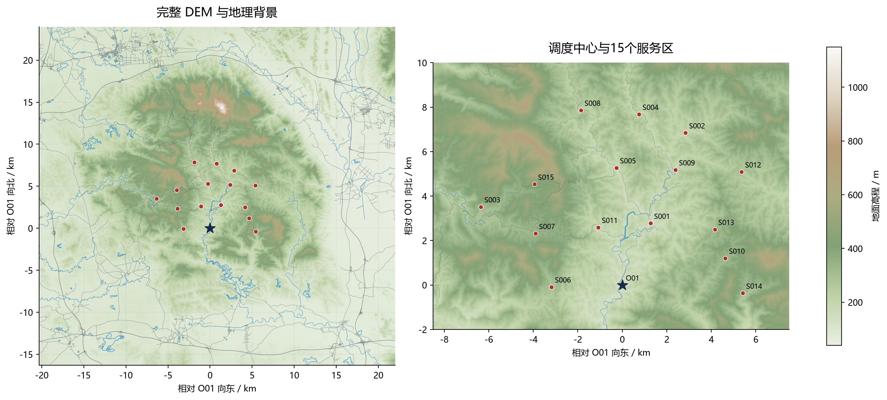
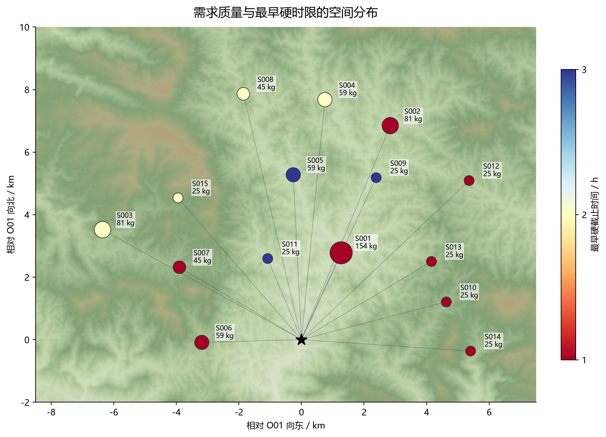
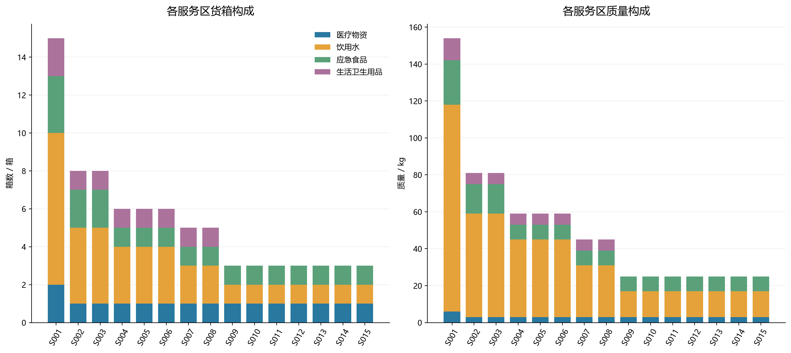
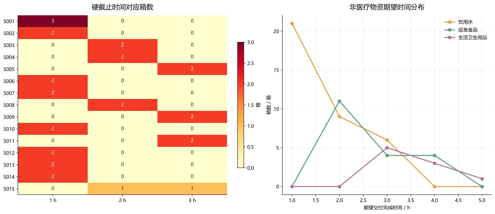
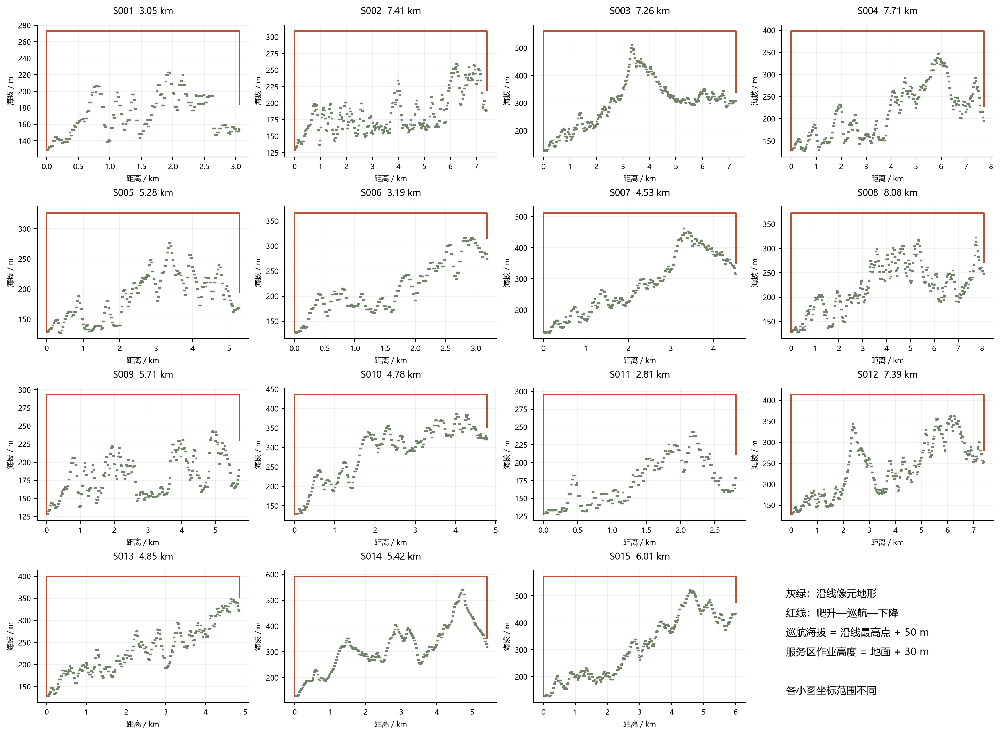
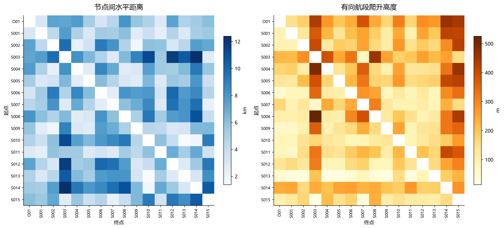
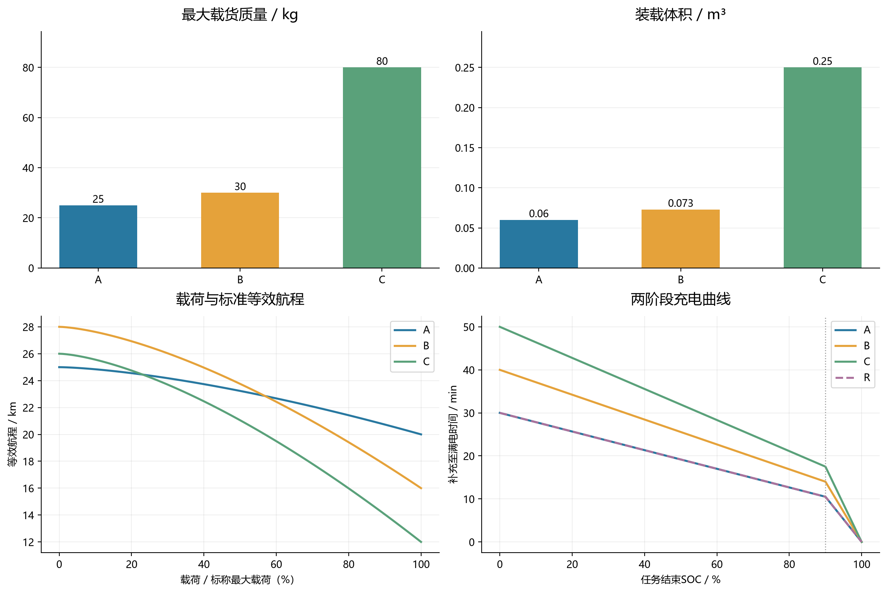
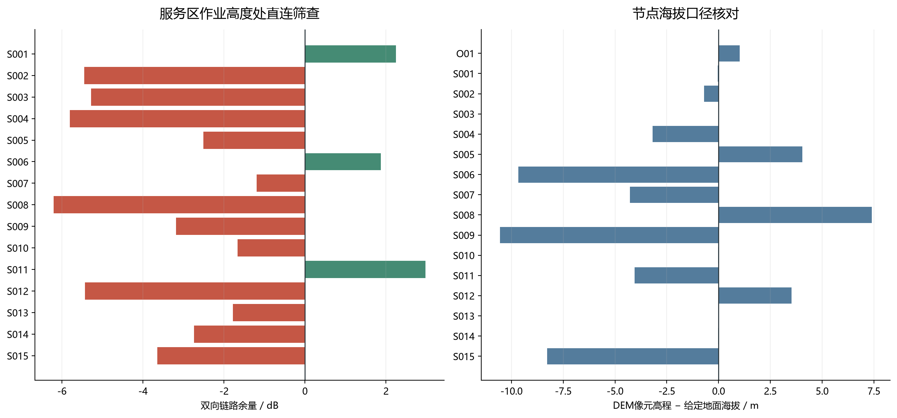

# D题数据预处理与可视化报告

已标准化16个节点、80个货箱、3种运输机型、8架运输无人机、14组运输电池、2架中继无人机、6组中继能源组件。
货物共758 kg、2.011 m³；首批30箱；医疗16箱；具有硬截止时间的货箱31箱。

## 数据检查与主要发现

- 已执行31项检查，错误0项，警告1项。详见tables/quality_checks.csv。
- DEM尺寸为1486列×1309行，有效高程41.69—1132.86m，NoData像元0个。
- 节点表海拔与对应DEM像元最大绝对差为10.5629m。
- O01到最远服务区S008的水平距离为8.079km；地形净空需另行计入。
- 本地距离相对WGS84测地距离最大误差0.05155%。
- 静态作业高度直连筛查不通过：S002、S003、S004、S005、S007、S008、S009、S010、S012、S013、S014、S015。
- S012与S014医疗箱的硬截止时间取3600秒，而不是其期望时间7200秒。S001第二箱医疗物资虽非首批，仍有3600秒硬截止。

## 处理规则及需要明确的建模约定

1. 原始附件只读。删除的仅为表格空白行、标题行和分节表头；不删除异常记录、不填补人为需求、不改变原始编号。
2. 标准单位为m、s、kg、m³、kWh、dB。返航电量百分数转换为0至1比例，源文件和源行号保存在标准表。
3. 非首批货箱的首批时限为空，含义是不适用；没有硬截止的货箱hard_deadline_s为空，不得填0。所有货箱均保留expected_s。
4. 医疗物资expected_s是硬约束，首批first_deadline_s也是硬约束，hard_deadline_s取两者适用最小值。
5. DEM读取GeoTIFF的PixelIsPoint标记，tiepoint为像元中心；NoData=-32767转NaN，绝不当0高程。MAT仅用于校验数据一致性。
6. 节点作业高度以节点表给定海拔为准，O01加0m，服务区加30m；DEM最近像元与双线性值均保留用于核对，不覆盖给定海拔。
7. 高程差5m是本次自定的质量提示阈值，并非题目约束；超过阈值不代表原始数据错误，也不进行自动修正。
8. 坐标采用以O01为原点的WGS84局部东西/南北线性米制投影。航线为该平面上的直线，其在经纬度中也是直线。对240个有向任务航段逐一与WGS84椭球测地距离比较。此局部近似仅用于当前任务区。
9. 每段按DEM闭像元supercover遍历，边界接触计入两侧像元，角点接触计入相邻像元；取全部穿越像元最高值+50m，保守避免漏山脊。通信筛查也按分片常值DEM及像元区间内最低视线高度判遮挡。
10. terrain_profiles只储存120条无向节点对的正向剖面；反向使用时t_enter_new=1-t_exit、t_exit_new=1-t_enter，并反转顺序。arcs含240条有向航段。
11. 矩阵节点顺序为O01,S001,...,S015，机型顺序A,B,C。对角线0仅为计算占位，不允许把它当作真实运输架次。flight_s只包含飞行，不含准备、装载、交接及周转。
12. 运输能耗系数采用显式推导约定：L(q)=L0-(L0-LF)(q/Q)^1.5；Ehor=energy_kwh*d/L(q)；Eup=(empty_mass_kg+q)*9.80665*climb/(eff*3.6e6)。Markdown题面没有完整展开这两项，需在正式模型中说明，当前未据此求解最大安全载荷。
13. 同机型共享电池跨同型飞机可调配、不同机型不可混用。电池编号BAT-A-01等和组件编号ENG-R-01等为本次生成，不是原题指定编号。初始SOC=1。库存已含初始装机资源。
14. 充电曲线使用题目两阶段公式，不添加未提供的充电桩数量限制。原始工位准备、逐箱装载、交接、建链、周转参数分别保留。
15. 通信采用双向较小损耗门限，距离为三维距离且FSPL公式使用km和MHz。预算距离只是给定遮挡状态下理论上限，不能当作实际覆盖圆。
16. service_direct_link_screening仅为服务区30m作业高度处静态筛查，不包含爬升/巡航/下降连续检查，不能据此宣称第三问通信可行或某服务区无法服务。
17. 道路、水体、水系和村镇为背景数据；没有洪水淹没范围、道路受损状态或禁飞区标签，不推断这些约束。水体环与顶点顺序完整保留，制图只描绘边界，避免把内环孔洞填实。
18. 本次未做货箱分批、任务调度或最优分区。图中的中心辐射线仅为地形分析航段，不是求解结果。

## 输出结构

- tables/：标准化CSV（UTF-8 BOM），可直接用于Python、MATLAB或Excel。data_dictionary.csv列出所有字段与缺失情况。
- spatial/dem.npz：elevation_m二维数组、lon_deg一维列坐标、lat_deg一维行坐标；北到南行序。
- spatial/routing_matrices.npz：distance_m、cruise_alt_m、climb_m、descent_m为16×16，flight_s为3×16×16；携带node_ids/type_ids。
- spatial/：投影参数、DEM元数据、带米制坐标的道路/水系/水体/村镇CSV。
- figures/：8组PNG高清图及SVG矢量图，后者适合论文排版（地形栅格仍为栅格）。
- index.html：离线可浏览图文报告，无需联网。source_manifest.json保存原始附件SHA-256。

## 对四问的支持

|问题|建议读取|后续仍需完成|
|---|---|---|
|第一问|boxes、transport_types、arcs、arc_type_coefficients|往返能量约束、最大安全载荷、质量体积联合组批及余量敏感性|
|第二问|上述表、transport_fleet、energy_resources、charging_curve|多点剩余载荷、具体机体与电池占用、交付完成时刻及多目标调度|
|第三问|DEM、communication_budgets、relay_types、relay_fleet、relay_energy_inventory|候选中继位置与海拔、逐阶段连续链路、建链时段及中继能源周转|
|第四问|第三问最终调度结果及本次资源库存表|固定任务和时序下不可拆服务区集合、各组独占资源与库存缺口|

## 复现

推荐在项目根目录的PowerShell运行 `./run_preprocessing.ps1`，自动选择本次使用的Python并运行预处理及独立验证；也可通过 `-PythonPath` 指定解释器。普通Python环境需先按requirements.txt安装依赖，再运行 `python preprocess_d.py` 和 `python verify_preprocessing.py`。原始数据在数据/下，输出写入preprocessing/；可选本项目.preprocess_deps目录优先加载。

读取示例：

```python
import pandas as pd, numpy as np
boxes = pd.read_csv("preprocessing/tables/boxes.csv")
nodes = pd.read_csv("preprocessing/tables/nodes.csv")
mat = np.load("preprocessing/spatial/routing_matrices.npz")
distance_m = mat["distance_m"]  # 顺序见 mat["node_ids"]
flight_s = mat["flight_s"]     # [机型, 起点, 终点]
```

## 图件

### 地形与任务节点



道路与水系为原始地理背景，不代表灾后通行状态。星号为O01，红点为服务区。

### 需求与时限空间分布



圆面积随需求质量增加；连线为单点分析航段，不是优化调度结果。

### 物资需求构成



质量与箱数使用各自单位；不按保障人口扩充或缩减附件需求。

### 硬时限与期望时限



首批非医疗物资仍受首批硬截止约束；右图仅展示其期望时间字段，不能据此取消首批要求。

### 15条中心直达航段地形剖面



按穿越像元计算最高地形，纵向红线表示爬升和下降；图示为单点分析，不是优化路线。

### 距离与爬升矩阵



主对角线不代表真实自环任务；爬升矩阵通常不对称，反向爬升等于正向下降。

### 机型能力与充电周转



等效航程不包含本场景具体爬升和安全余量，不能直接当作可执行往返距离；A与R充电曲线重合。

### 通信初筛与高程一致性



直连筛查仅针对服务区离地30米静态位置，不能证明整段飞行连续通信；红色为静态直连不可用。
