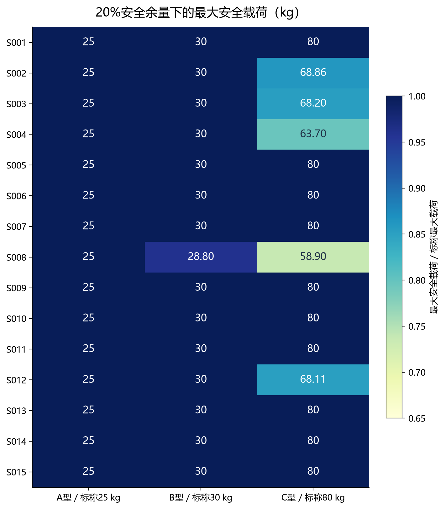
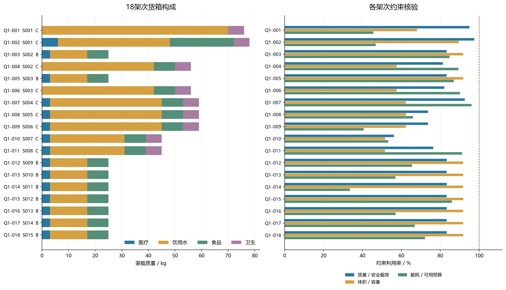
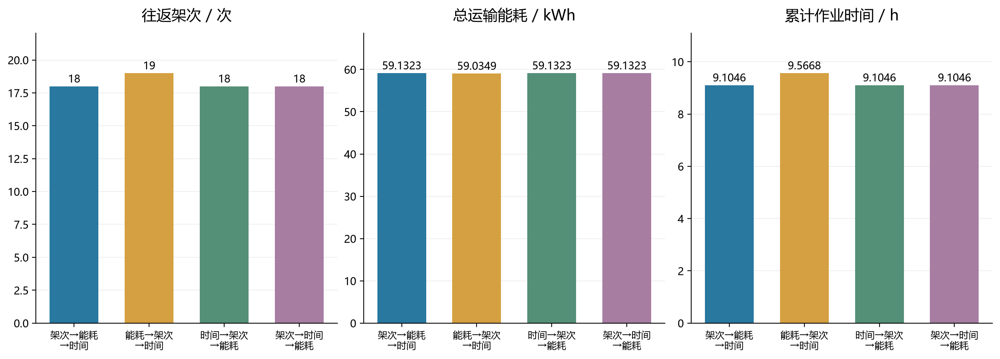
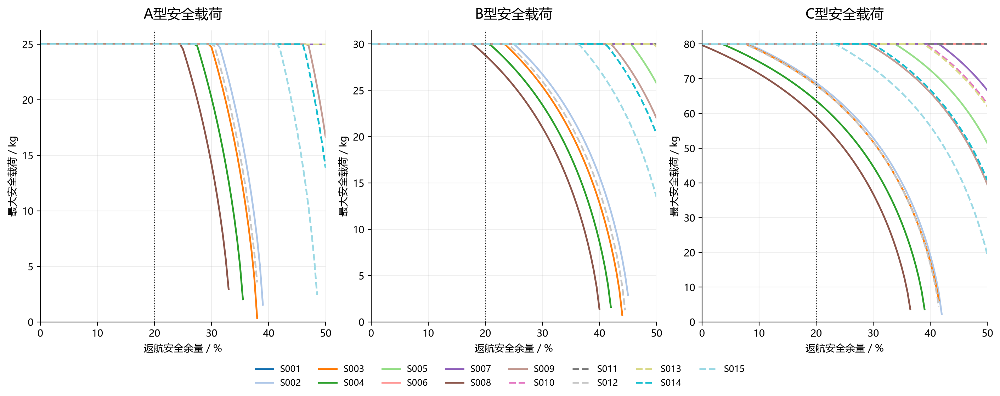
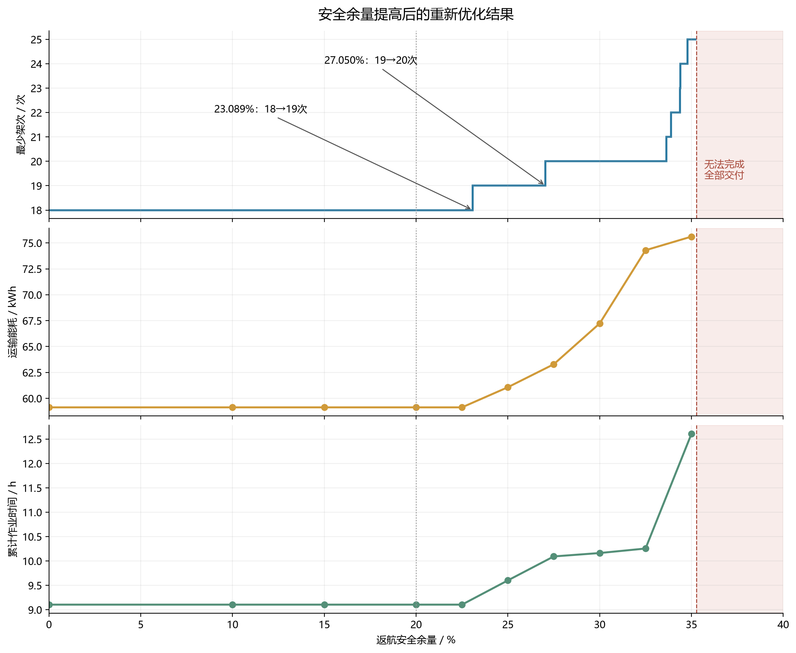

# 问题一：单点往返运输能力与货箱组批优化

## 1. 问题范围与建模思路

本问每个架次只能执行O01→一个服务区→O01，80个货箱不可拆分、不可重复或漏运。15个服务区之间不允许混装。不限制实体无人机和共享电池的数量、并行关系或充电周转，也不在本问施加第二问的逐箱配送时限。

先由DEM和给定机型建立单点往返的时间与能量模型，计算每个“机型—服务区”组合的最大安全载荷；再完整枚举满足质量、体积和能量约束的箱组，采用有限状态动态规划精确求解组批问题。主方案采用**架次数→总运输能耗→累计作业时间**的字典序优先关系，并以其他目标顺序和Pareto前沿展示权衡。

### 1.1 数据与假设

1. 采用已预处理的节点、货箱、三类运输机型和DEM航段数据。货箱总数80，总质量758 kg，总体积2.011 m³。返航安全余量基准值为20%。
2. 给定地面海拔用于起降/作业高度，DEM用于沿线最高地形。两者不强制改为相同。航线采用以O01为原点的局部米制直线，与WGS84测地距离的最大相对差为0.05155%。
3. 固定速度、机型参数及题目航程—载荷公式，不另加入题目未给定的风雨折减、机体故障或充电资源约束。
4. 去程携带整批货物，交付后返程有效载荷为0。能耗采用题目“水平巡航＋爬升附加”的口径，下降附加能耗为0，但下降时间必须计入。
5. **明确的能耗推导约定**：由标准航程定义采用水平单位距离能耗Euse/L(q)，爬升采用势能除以效率。现有Markdown题面未完整展开两项表达式，以下两式属于沿用预处理的物理推导约定。数值结论以此口径为条件。
6. 未给出运输机交接悬停功率，且题面将架次运输能耗定义为各航段能耗之和，因此不额外虚构交接悬停能耗。累计作业时间仍完整包含交接。

### 1.2 符号

|符号|含义|
|---|---|
|i、g|服务区i，机型g∈{A,B,C}|
|B_i|服务区i的货箱集合|
|Q_g、V_g|标称最大载货质量与可用体积|
|m_g、E_g|含电池空载总质量与单组电池可用能量|
|L_g^0、L_g^F|空载与满载标准航程|
|ρ|返航安全余量比例|
|d_i、H_i|O01与服务区水平距离、沿线最高DEM高程加50 m|
|z_0、z_i|O01地面海拔、服务区给定地面海拔加30 m|
|q、v、n|某架次货箱总质量、总体积、箱数|
|E、T、N|总运输能耗、累计作业时间、往返架次数|

## 2. 单点往返时间与能量模型

### 2.1 航段地形与飞行时间

沿直线穿越的所有DEM闭像元取最大高程，边界接触像元也计入，防止漏掉山脊：

\[
H_i=\max_{u\in\mathcal C_i}Z_u+50,\qquad
a_i=H_i-z_0,\qquad b_i=H_i-z_i.
\]

去程爬升a_i、下降b_i；返程爬升b_i、下降a_i。于是往返纯飞行时间为

\[
\tau_{gi}=\frac{a_i+b_i}{v_g^{\uparrow}}+
\frac{2d_i}{v_g^c}+\frac{a_i+b_i}{v_g^{\downarrow}}.
\]

不同服务区地形不同，即使水平距离相同，也可能有不同的爬升和往返时间。

### 2.2 去程载货、返程空载的能耗

\[
L_g(q)=L_g^0-(L_g^0-L_g^F)(q/Q_g)^{3/2},\quad 0\le q\le Q_g.
\]

以kWh为能量单位，g_0=9.80665 m/s²，η_g为爬升效率：

\[
E_{gi}(q)=E_gd_i\left[\frac1{L_g(q)}+\frac1{L_g^0}\right]
+\frac{g_0}{3.6\times10^6\eta_g}
\left[(m_g+q)a_i+m_gb_i\right].
\]

第一项是去程载货和返程空载的水平能耗，第二项是两程爬升能耗。质量m_g已包含电池，不再重复加电池质量。可行性要求

\[
E_{gi}(q)\le(1-\rho)E_g,\qquad
SOC_{return}=1-E_{gi}(q)/E_g\ge\rho.
\]

安全余量约束施加于**完整往返能耗**，不是只为返程保留ρ倍的返程能耗。

### 2.3 最大安全载荷与求解原理

\[
q^{safe}_{gi}(\rho)=\max\{q:0\le q\le Q_g,\ E_{gi}(q)\le(1-\rho)E_g\}.
\]

记Δ_g=L_g^0−L_g^F>0，对q>0有

\[
E'_{gi}(q)=
\frac{E_gd_i}{L_g(q)^2}\frac{3\Delta_g}{2Q_g}\sqrt{q/Q_g}
+\frac{g_0a_i}{3.6\times10^6\eta_g}>0.
\]

因此能耗随载荷单调增加，可用二分法稳定求得唯一能量边界：

- E(0)>(1−ρ)E_g：连空载往返也不可行，标记“不可达”，不能把0 kg写成可行载荷。
- E(Q_g)≤(1−ρ)E_g：最大安全载荷就是标称Q_g。
- 其他情况：在[0,Q_g]二分求E(q)=(1−ρ)E_g，取可行侧下界。

程序进行70次二分。表中小数仅用于展示，组批可行性始终使用未四舍五入的能耗。**安全载荷是质量—能量上限；具体箱组还必须满足体积与不可拆约束，不能仅依据此表组批。**

## 3. 三种机型在15个服务区的最大安全载荷

以下均为ρ=20%的结果，单位kg。

|服务区|A型/kg|B型/kg|C型/kg|
|---|---|---|---|
|S001|25.0000|30.0000|80.0000|
|S002|25.0000|30.0000|68.8581|
|S003|25.0000|30.0000|68.1995|
|S004|25.0000|30.0000|63.6983|
|S005|25.0000|30.0000|80.0000|
|S006|25.0000|30.0000|80.0000|
|S007|25.0000|30.0000|80.0000|
|S008|25.0000|28.8014|58.9042|
|S009|25.0000|30.0000|80.0000|
|S010|25.0000|30.0000|80.0000|
|S011|25.0000|30.0000|80.0000|
|S012|25.0000|30.0000|68.1097|
|S013|25.0000|30.0000|80.0000|
|S014|25.0000|30.0000|80.0000|
|S015|25.0000|30.0000|80.0000|

能量约束生效的组合：S002-C：68.8581 kg；S003-C：68.1995 kg；S004-C：63.6983 kg；S008-B：28.8014 kg；S008-C：58.9042 kg；S012-C：68.1097 kg。其他组合由标称载质量限制。

## 4. 不可拆货箱的组批优化模型

### 4.1 可行架次模式

对服务区i，模式p是“某一箱组＋一个机型g(p)”。设a_bp表示货箱b是否属于p，w_b、v_b分别为单箱质量和体积，则

\[
q_p=\sum_{b\in B_i}w_ba_{bp},\quad
v_p=\sum_{b\in B_i}v_ba_{bp},\quad
n_p=\sum_{b\in B_i}a_{bp}.
\]

只保留满足下式的模式集合P_i(ρ)：

\[
1\le n_p,\quad q_p\le Q_{g(p)},\quad v_p\le V_{g(p)},\quad
E_{g(p),i}(q_p)\le(1-\rho)E_{g(p)}.
\]

累计作业时间必须区别于纯飞行时间：

\[
t_p=t^{prep}_{g(p)}+n_pt^{load}_{g(p)}+\tau_{g(p),i}
+t^{handover,0}_{g(p)}+n_pt^{handover,box}_{g(p)}.
\]

本题A/B型每箱装载加交接共60 s，C型66 s；每架次固定准备300 s，基础交接A/B型150 s、C型180 s。

### 4.2 集合划分模型

对以原箱ID定义的模式，x_p∈{0,1}表示是否执行：

\[
\sum_{p\in P_i:\,b\in p}x_p=1,\qquad \forall b\in B_i,\ \forall i.
\]

这保证每箱恰好交付一次。三个目标为

\[
N=\sum_px_p,\qquad E=\sum_pE_px_p,\qquad T=\sum_pt_px_p.
\]

主方案为lex min(N,E,T)：先求N*，在N=N*下最小化E，再在前两者最优的方案中最小化T。无需把架次、kWh和秒未经归一化直接相加，也不会因随意权重导致多飞一架次只换来极小收益。

这一优先关系用于控制起降与交接次数，适合作为运输组织基准；它是明确的决策选择，不意味着能耗优先永远不合理。第6节给出不同偏好的精确对照。

### 4.3 按同物性货箱压缩的精确动态规划

第一问不施加时限，同服务区同类箱具有相同质量和体积，因此可按四类物资的数量向量c=(c_med,c_water,c_food,c_hyg)表示箱组。此压缩不跨服务区，也不合并不同质量或体积的箱子。原始箱ID在求解后逐一还原。

设D_i为服务区需求数量向量、a_p为模式p的数量向量。压缩后的等价整数模型是

\[
\sum_{p\in P_i}a_{pk}y_p=D_{ik},\quad y_p\in\mathbb Z_{\ge0},\quad k=1,2,3,4.
\]

模式可以重复，是因为相同物性的不同货箱可以组成相同数量的批次；还原ID后每个箱仍只出现一次。

令F_i(s)是恰好运完数量状态s时最优的(N,E,T)，则

\[
F_i(0)=(0,0,0),\quad
F_i(s)=\operatorname{lexmin}_{a_p\le s}
\{F_i(s-a_p)+(1,E_p,t_p)\}.
\]

按照状态中货箱总数递增计算，并保存回溯模式。每个非空解都包含某个最后架次，删去它必然落到较小状态，因此递推枚举了所有可行组批，不是贪心近似。

S001的需求向量为(2,8,3,2)，状态数仅(2+1)(8+1)(3+1)(2+1)=324；其他服务区更小。15个服务区没有跨区装载或公共资源耦合，目标可加，因此分别求得逐区字典序最优解后相加就是本问全局字典序最优解。

本次共枚举742个在ρ=0时物理可行的“数量模式—机型”组合，ρ=20%时其中732个可用。

## 5. 主方案数值结果

**最少往返架次数N*=18；在此架次数下最低运输能耗E*=59.132260327 kWh；累计作业时间T*=32776.516783 s=9.104588 h。**
机型使用架次：A型0、B型9、C型9。这些是架次，不是所需实体飞机数量。
累计纯飞行时间为19288.516783 s；准备、装载和交接共13488.000000 s。最低返航SOC为23.089248%，全部架次满足20%下限。
架次数的简单下界也可直接证明：每个非空服务区至少1架次，共15次；S001总质量154 kg，S002和S003各81 kg，均超过全部机型中的最大载重80 kg，因此这三个服务区各至少增加1次，得到N≥18。上述可行方案恰为18次，故最少架次数不依赖求解器声明即可证实。

### 5.1 各服务区汇总

|服务区|架次|能耗/kWh|累计作业/s|质量/kg|体积/m³|箱数|最低SOC比例|机型|
|---|---|---|---|---|---|---|---|---|
|S001|2|5.91336|3186.35|154|0.394|15|0.625528|C,C|
|S002|2|8.43483|3858.57|81|0.211|8|0.28483|B,C|
|S003|2|8.54544|4450.79|81|0.211|8|0.279329|B,C|
|S004|1|6.15286|2301.05|59|0.156|6|0.230892|C|
|S005|1|4.22214|1877.19|59|0.156|6|0.472233|C|
|S006|1|2.59794|1561.55|59|0.156|6|0.675258|C|
|S007|1|3.411|1907.6|45|0.129|5|0.573625|C|
|S008|1|5.83602|2199.71|45|0.129|5|0.270497|C|
|S009|1|2.09627|1558.46|25|0.067|3|0.475934|B|
|S010|1|1.82322|1555.4|25|0.067|3|0.544196|B|
|S011|1|1.07394|1188.42|25|0.067|3|0.731516|B|
|S012|1|2.7526|1922.83|25|0.067|3|0.31185|B|
|S013|1|1.82483|1510.51|25|0.067|3|0.543793|B|
|S014|1|2.14029|1869.75|25|0.067|3|0.464927|B|
|S015|1|2.30753|1828.33|25|0.067|3|0.423118|B|

### 5.2 逐架次货箱组批

数量简记为“医、水、食、卫”；完整原始货箱编号保存在plan_N_E_T.csv及工作簿Q1_单点组批。下面的货箱ID表将80箱全部列出。

|架次|服务区|机型|医/水/食/卫|质量/kg|体积/m³|能耗/kWh|作业时间/s|返航SOC/%|
|---|---|---|---|---|---|---|---|---|
|Q1-001|S001|C|0/5/0/1|76|0.17|2.91759|1494.18|63.5301|
|Q1-002|S001|C|2/3/3/1|78|0.224|2.99578|1692.18|62.5528|
|Q1-003|S002|B|1/1/1/0|25|0.067|2.71347|1816.72|32.1632|
|Q1-004|S002|C|0/3/1/1|56|0.144|5.72136|2041.84|28.483|
|Q1-005|S003|B|1/1/1/0|25|0.067|2.78008|2080.61|30.498|
|Q1-006|S003|C|0/3/1/1|56|0.144|5.76536|2370.18|27.9329|
|Q1-007|S004|C|1/3/1/1|59|0.156|6.15286|2301.05|23.0892|
|Q1-008|S005|C|1/3/1/1|59|0.156|4.22214|1877.19|47.2233|
|Q1-009|S006|C|1/3/1/1|59|0.156|2.59794|1561.55|67.5258|
|Q1-010|S007|C|1/2/1/1|45|0.129|3.411|1907.6|57.3625|
|Q1-011|S008|C|1/2/1/1|45|0.129|5.83602|2199.71|27.0497|
|Q1-012|S009|B|1/1/1/0|25|0.067|2.09627|1558.46|47.5934|
|Q1-013|S010|B|1/1/1/0|25|0.067|1.82322|1555.4|54.4196|
|Q1-014|S011|B|1/1/1/0|25|0.067|1.07394|1188.42|73.1516|
|Q1-015|S012|B|1/1/1/0|25|0.067|2.7526|1922.83|31.185|
|Q1-016|S013|B|1/1/1/0|25|0.067|1.82483|1510.51|54.3793|
|Q1-017|S014|B|1/1/1/0|25|0.067|2.14029|1869.75|46.4927|
|Q1-018|S015|B|1/1/1/0|25|0.067|2.30753|1828.33|42.3118|

|架次|完整货箱编号|
|---|---|
|Q1-001|S001-WAT-01;S001-WAT-02;S001-WAT-03;S001-WAT-04;S001-WAT-05;S001-HYG-01|
|Q1-002|S001-MED-01;S001-MED-02;S001-WAT-06;S001-WAT-07;S001-WAT-08;S001-FOD-01;S001-FOD-02;S001-FOD-03;S001-HYG-02|
|Q1-003|S002-MED-01;S002-WAT-01;S002-FOD-01|
|Q1-004|S002-WAT-02;S002-WAT-03;S002-WAT-04;S002-FOD-02;S002-HYG-01|
|Q1-005|S003-MED-01;S003-WAT-01;S003-FOD-01|
|Q1-006|S003-WAT-02;S003-WAT-03;S003-WAT-04;S003-FOD-02;S003-HYG-01|
|Q1-007|S004-MED-01;S004-WAT-01;S004-WAT-02;S004-WAT-03;S004-FOD-01;S004-HYG-01|
|Q1-008|S005-MED-01;S005-WAT-01;S005-WAT-02;S005-WAT-03;S005-FOD-01;S005-HYG-01|
|Q1-009|S006-MED-01;S006-WAT-01;S006-WAT-02;S006-WAT-03;S006-FOD-01;S006-HYG-01|
|Q1-010|S007-MED-01;S007-WAT-01;S007-WAT-02;S007-FOD-01;S007-HYG-01|
|Q1-011|S008-MED-01;S008-WAT-01;S008-WAT-02;S008-FOD-01;S008-HYG-01|
|Q1-012|S009-MED-01;S009-WAT-01;S009-FOD-01|
|Q1-013|S010-MED-01;S010-WAT-01;S010-FOD-01|
|Q1-014|S011-MED-01;S011-WAT-01;S011-FOD-01|
|Q1-015|S012-MED-01;S012-WAT-01;S012-FOD-01|
|Q1-016|S013-MED-01;S013-WAT-01;S013-FOD-01|
|Q1-017|S014-MED-01;S014-WAT-01;S014-FOD-01|
|Q1-018|S015-MED-01;S015-WAT-01;S015-FOD-01|

## 6. 多目标权衡与优先关系

|目标优先顺序|架次|能耗/kWh|累计作业/h|A架次|B架次|C架次|
|---|---|---|---|---|---|---|
|架次→能耗→时间（主方案）|18|59.1323|9.10459|0|9|9|
|能耗→架次→时间|19|59.0349|9.5668|0|11|8|
|时间→架次→能耗|18|59.1323|9.10459|0|9|9|
|架次→时间→能耗|18|59.1323|9.10459|0|9|9|

相对主方案，能耗优先方案架次变化+1，能耗变化-0.097383 kWh（-0.165%），累计作业时间变化+27.733 min。
时间优先方案架次变化+0，能耗变化+0.000000 kWh，累计作业时间变化+0.000 min。
本数据的差异集中在S008：主方案用1架次C型装45 kg；纯能耗最优方案改为2架次B型，分别装20 kg和25 kg。其余服务区的最优目标值一致。因此主方案用额外约0.165%的能量换取少1架次和约27.73分钟累计作业时间，作为基准更合适。

从模型看，增加架次会重复固定准备、基础交接和空载返程，通常增加时间；但较少架次有时需使用能量更大的C型，故不保证最少架次同时最低能耗。即便同一机型，L(q)的非线性也使“尽量装满”不能代替能耗优化。

在固定N=N*时，对每个数量状态保留(E,T)全部非支配标签；逐区前沿作组合加和并删除被支配点，得到该条件下完整的E—T前沿。一个点若不存在另一个能耗和时间均不更差、且至少一项更好的点，就称为非支配点。此处完整前沿只针对**最少架次条件**，并未声称枚举所有架次数的三维Pareto集合。

本数据在最少18架次条件下共有1个非支配目标点，详见pareto_at_min_trips.csv。若不同目标优先顺序落在同一点，应如实报告目标一致，不能人为制造权衡。

## 7. 返航安全余量敏感性

### 7.1 对最大安全载荷的影响

当机型仍受标称载质量限制时，安全余量小幅增加可能不改变q_safe；一旦能量约束成为有效边界，隐函数求导给出

\[
\frac{dq^{safe}_{gi}}{d\rho}=-\frac{E_g}{E'_{gi}(q^{safe}_{gi})}<0.
\]

故最大安全载荷关于余量单调不增，但不同距离、地形和机型的变化速度不同。连续载荷下降不必立即改变整数箱组：只有某个具体箱组跨过可行性边界，方案才可能改变。

### 7.2 对组批与目标值的影响

对完整模式p，可承受的最大安全余量为

\[
\bar\rho_p=1-E_p/E_{g(p)}.
\]

当ρ≤ρ̄_p时模式可行，超过阈值后不可行。因此最少架次数关于ρ是单调不减的阶梯函数；即使架次不变，机型和箱组也可能已变化。需要区分可行域缩小与不同主目标下的能耗变化：**纯能耗最优值**在可行域缩小时不可能下降，但字典序(N,E,T)在N发生跳变后，所选方案的E不必单调。

以下每个情景均从头精确重优化，而非只检查原方案。不可行表示至少一个服务区无法用三种机型完成全部货箱，不给出部分交付伪装为完整方案。

|余量比例|全部可行|架次|能耗/kWh|累计作业/h|A架次|B架次|C架次|无法完成的服务区|
|---|---|---|---|---|---|---|---|---|
|0|True|18|59.1323|9.10459|0|9|9||
|0.1|True|18|59.1323|9.10459|0|9|9||
|0.15|True|18|59.1323|9.10459|0|9|9||
|0.2|True|18|59.1323|9.10459|0|9|9||
|0.225|True|18|59.1323|9.10459|0|9|9||
|0.25|True|19|61.0743|9.60171|0|10|9||
|0.275|True|20|63.2911|10.0933|0|11|9||
|0.3|True|20|67.2287|10.163|0|9|11||
|0.325|True|20|74.2946|10.2555|0|6|14||
|0.35|True|25|75.6089|12.6067|0|15|10||
|0.375|False|不可行|不可行|不可行|不可行|不可行|不可行|S008|
|0.4|False|不可行|不可行|不可行|不可行|不可行|不可行|S004;S008|
|0.45|False|不可行|不可行|不可行|不可行|不可行|不可行|S002;S003;S004;S008;S012|
|0.5|False|不可行|不可行|不可行|不可行|不可行|不可行|S002;S003;S004;S008;S012|

### 7.3 精确架次变化阈值

离散情景可能漏掉很窄的变化区间，因此另用最大瓶颈动态规划。令B_i(s,k)为使用恰好k架次完成状态s时可支持的最大公共余量：

\[
B_i(0,0)=1,\quad
B_i(s,k)=\max_{a_p\le s}\min\{\bar\rho_p,B_i(s-a_p,k-1)\}.
\]

由此n_i(ρ)=min{k:B_i(D_i,k)≥ρ}，全局N*(ρ)=Σ_i n_i(ρ)。此方法给出模式切换引起的**精确阈值**，精确性限于给定物理数据与浮点数值精度。区间端点等号仍属于较少架次一侧。

|余量区间|最少架次|
|---|---|
|[0.00000000%, 23.08924839%]|18|
|(23.08924839%, 27.04974165%]|19|
|(27.04974165%, 33.62567058%]|20|
|(33.62567058%, 33.89233051%]|21|
|(33.89233051%, 34.37428683%]|22|
|(34.37428683%, 34.39036177%]|23|
|(34.39036177%, 34.77774519%]|24|
|(34.77774519%, 35.26764735%]|25|

完整交付可支持的最大公共安全余量为**35.26764735%**，瓶颈服务区为S008；超过该值，即使拆为单箱架次也不能完成全部任务。
瓶颈具体是S008的14 kg饮用水箱：即便由该单箱任务余量表现最好的C型单独运输，其返航SOC也仅35.26764735%。在无限实体飞机/电池的本问中，所有箱单独可运是完整交付可行的充分条件；能耗随载荷单调递增，又使任何单箱在所有机型上不可运成为整体不可行的必要证据。
主方案的最小返航SOC为S004的23.08924839%，因此将安全余量从20%提高到该值时，原18架次方案仍可行且仍最优。超过此值S004至少需2次，总架次增为19；超过27.04974165%后S008也不能一架次完成，总数至少20。25%至32.5%的详细表还显示：架次数不变时，机型和装载分配仍会改变。

## 8. 可行性、最优性核验与交付文件

独立验证程序verify_q1.py不使用输出的箱组能耗作为依据，而按每个箱ID、机型和航段重算质量、体积、载荷航程、能耗、作业时间和SOC；检查80箱恰出现一次。
最优性采用两条证据：完整状态递推的归纳证明，以及逐区独立整数规划交叉求解。MILP首先最小化架次，固定最少架次后最小化能耗，与动态规划数值对比；实际求解状态和差值见verification.json及milp_crosscheck.csv。
浮点比较容差：能耗1e−9 kWh、时间1e−7 s；MILP数值核验另保留其求解器容差。约束以未舍入数值判断。

- `tables/maximum_safe_payload.csv`：45组最大安全载荷、能量预算、空载/满载能耗与地形量。
- `tables/Q1_单点组批.csv`：与提交模板同名工作表的九列一致；“往返时间”在本交付中约定为完整单架次作业时间，纯飞行时间另存plan_N_E_T.csv。
- `tables/plan_N_E_T.csv`、`box_assignment_N_E_T.csv`：主方案详细分项与逐箱归属。
- `tables/plan_E_N_T.csv`、`plan_T_N_E.csv`、`plan_N_T_E.csv`：其他优先关系的完整可执行箱组。
- `tables/reserve_sensitivity_all_trips.csv`：所有可行情景的逐架次完整货箱编号。
- `tables/exact_site_trip_thresholds.csv`、`exact_global_trip_steps.csv`：逐区瓶颈阈值与全局阶梯区间。
- `figures/`：最大载荷、箱组约束利用率、多目标对比和安全余量敏感性图，PNG与SVG两种格式。

## 9. 复现

在项目根目录运行 `./run_q1.ps1`，依次执行求解、独立核验与绘图。单独运行可用 `python solve_q1.py`、`python verify_q1.py`、`python visualize_q1.py`。绘图和MILP使用本项目.preprocess_deps中的已安装依赖。
正式用于论文时，应保留本报告关于能耗推导、累计时间定义和地形离散处理的说明；不能将本问累计作业时间解释为第二问的多机最晚返航时间。

<!-- FIGURES_AND_VALIDATION -->
## 10. 实际核验结果与图件

独立核验实际通过105项、失败0项。15个服务区的整数规划均报告最优，最优间隙均为0；与动态规划固定最少架次能耗的最大差为7.15e-12 kWh。完整日志见verification.json。

### 最大安全载荷

数字为kg，颜色为相对标称载重比例。具体箱组仍需满足体积限制。

### 主方案箱组与约束利用率

每个货箱恰出现一次。利用率不超过100%，所有架次返航SOC不低于20%。

### 多目标优先关系对照

主方案与最短累计时间方案一致。能耗优先方案增加1架次，只节省0.09738 kWh，增加约27.73分钟。

### 最大安全载荷对余量的敏感性

竖虚线为20%基准。曲线终止表示空载往返也不可行；重合曲线代表相同的标称载重限制。

### 组批结果与精确架次阈值

上图为精确阶梯区间；下两图为离散情景重优化点的连线，不表示区间内线性变化。35.267647%为完整交付可行极限。

