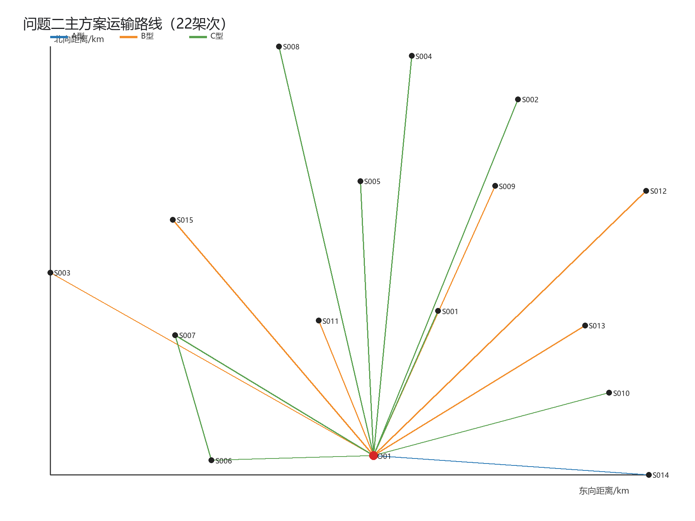
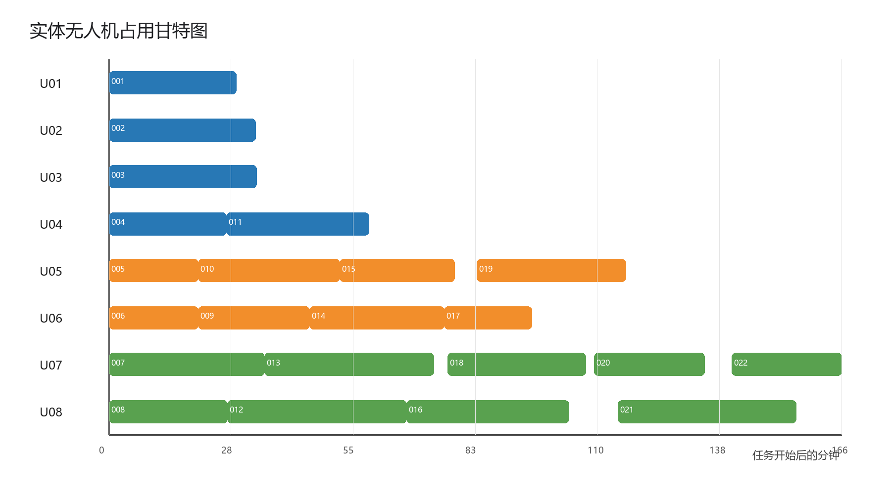
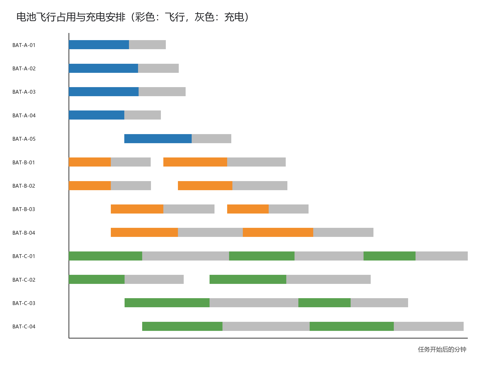
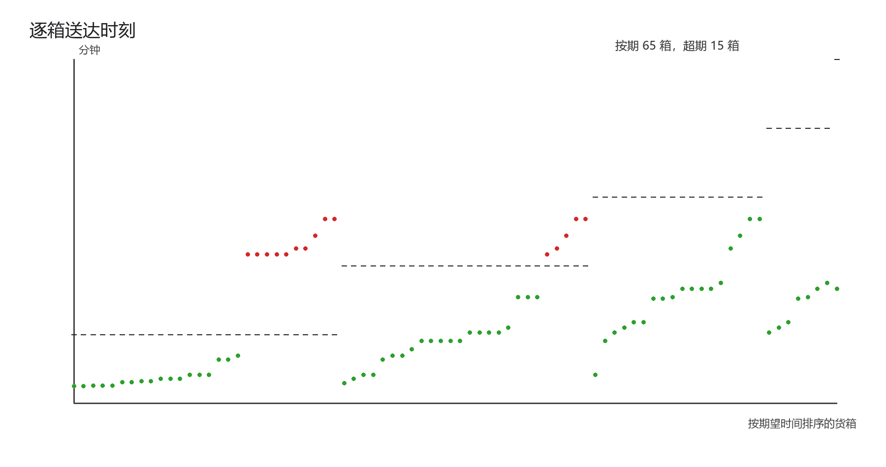
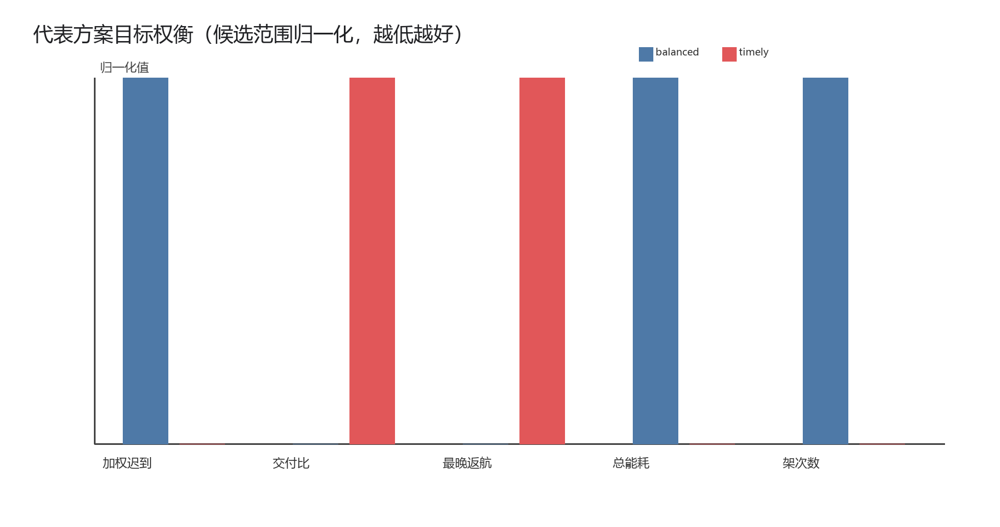

# 问题二：异构无人机多点多架次运输调度

## 1. 建模范围与计算口径

本问允许一个架次访问一个或多个服务区，联合决定货箱组批、访问顺序、机型、具体无人机、共享电池和开始时刻。全部货箱不可拆分且只能交付一次。医疗物资期望时间、首批保障截止时间作为硬约束；其他物资的期望时间用于评价及时性。

沿用问题一的航段地形、时间与能量模型。多点路径p=(O01,i1,...,ik,O01)中，q_l为第l段起飞时的剩余载荷：

\[
q_1=\sum_{b\in B_p}w_b,\qquad q_{l+1}=q_l-\sum_{b	ext{在}i_l	ext{交付}}w_b.
\]

每段能耗为

\[
E_{gij}(q)=E_gd_{ij}/L_g(q)+(m_g+q)g_0h^+_{ij}/(3.6	imes10^6\eta_g),
\]

总能耗为各段之和，并满足E_p≤(1−ρ_g)E_g。每次交付后重新从服务区离地30m作业高度爬升。下降耗时计入，下降附加能耗取0。水平耗能和势能爬升式是与问题一一致的推导约定。

任务开始时刻从准备开始计。起飞前完成固定准备和全部货箱装载；服务区的交付完成时刻为到达后完成基础交接及逐箱交接的时刻；返航时刻为最后一段下降至O01后的时刻。

## 2. 资源约束模型

若架次p分配给实体飞机u和电池r，开始、返航分别为s_p、f_p，则同一飞机的任务区间[s_p,f_p)不得重叠。同一电池也不得重叠，并且任务后SOC为1−E_p/E_g，再次使用前必须充至100%。充电完成时刻为

\[
a_r=f_p+t_{chg}(1-E_p/E_g).
\]

同型电池可跨同型飞机共享，不同机型不可混用。库存A/B/C型电池分别为6/4/4组，其中包含初始装机电池。题目未给充电桩数量上限，因此不同电池并行充电。

## 3. 多目标函数

对货箱b，交付时刻C_b、期望时间d_b、优先系数w_b。硬时限H_b存在时要求C_b≤H_b。及时性同时报告

\[
J_{late}=\sum_b w_b\max(0,C_b-d_b)/d_b,
\quad
J_{ratio}=rac{\sum_bw_bC_b/d_b}{\sum_bw_b}.
\]

J_late强调超期程度，J_ratio在全部按期时仍能区分更早交付。全部任务完成时间为所有运输无人机最后返航时刻T_max=max_p f_p，另计总能耗和架次数。

求解中先强制硬时限，然后收集(J_late,J_ratio,T_max,E,N)非支配解。主方案从非支配集中，按J_ratio、T_max、E、N分别以候选集理想值和最差值归一化，选取四项等权平方距离最小的折中点。该规则避免把秒、kWh和架次直接相加。另给出及时性、完工时间、能耗及架次数优先方案。

## 4. 求解方法

以问题一18个已核验单点箱组作为初始可行模式，保证80个原始货箱ID不重不漏。对任意两条路线尝试合并，枚举合并后不超过3个服务区的所有访问顺序和A/B/C机型，逐段按剩余载荷检查质量、体积、能量及返航SOC。使用有限宽度束搜索逐层减少架次。

每个路线集合进入离散事件调度器。调度器记录8架飞机和14组电池的下一可用时刻，为候选任务选择可用的同型飞机和满电电池，并更新返航与充电完成时刻。对任务优先序进行固定随机种子的交换、插入和期限扰动搜索。全部结果可复现，但该组合问题采用启发式全局搜索，因此“非支配”与“理想点”均限于已搜索候选集；报告不把它误称为全局最优证明。

## 5. 主方案结果

主方案共22架次，全部80箱交付；硬时限违反0箱；期望时间内交付65箱。加权迟到指标167.640248，加权交付比例0.703041。最后返航时刻为9943.021474s（2.761950h），总运输能耗67.304897kWh。

最晚的硬时限交付裕量为1119.550417s；最低返航SOC为20.943758%。使用实体飞机8架，使用不同电池13组。

### 5.1 运输路线与架次安排

|架次|无人机|机型|电池|开始/s|访问顺序|返航/s|能耗/kWh|返航SOC|货箱编号|
|---|---|---|---|---|---|---|---|---|---|
|Q2-001|U01|A|BAT-A-01|0.000000|S007|1727.466886|1.905383|0.576581|S007-MED-01;S007-WAT-01|
|Q2-002|U02|A|BAT-A-02|0.000000|S014|1990.398885|2.290878|0.490916|S014-MED-01;S014-WAT-01|
|Q2-003|U03|A|BAT-A-03|0.000000|S002|2003.775208|2.920018|0.351107|S002-MED-01;S002-WAT-01|
|Q2-004|U04|A|BAT-A-04|0.000000|S010|1594.892670|1.867965|0.584897|S010-FOD-01|
|Q2-005|U05|B|BAT-B-01|0.000000|S001|1209.106176|1.073972|0.731507|S001-MED-01;S001-MED-02;S001-WAT-01|
|Q2-006|U06|B|BAT-B-02|0.000000|S006|1207.270011|1.098747|0.725313|S006-MED-01;S006-WAT-01|
|Q2-007|U07|C|BAT-C-01|0.000000|S002|2107.842166|6.105797|0.236775|S002-FOD-01;S002-FOD-02;S002-HYG-01;S002-WAT-02;S002-WAT-03;S002-WAT-04|
|Q2-008|U08|C|BAT-C-02|0.000000|S010|1602.732365|3.149861|0.606267|S010-MED-01;S010-WAT-01|
|Q2-009|U06|B|BAT-B-03|1207.270011|S013|2717.781600|1.824828|0.543793|S013-FOD-01;S013-MED-01;S013-WAT-01|
|Q2-010|U05|B|BAT-B-04|1209.106176|S012|3131.932990|2.752600|0.311850|S012-FOD-01;S012-MED-01;S012-WAT-01|
|Q2-011|U04|A|BAT-A-05|1594.892670|S014|3525.291555|2.188493|0.513668|S014-FOD-01|
|Q2-012|U08|C|BAT-C-03|1602.732365|S003|4038.910076|6.324499|0.209438|S003-FOD-01;S003-MED-01;S003-WAT-01;S003-WAT-02;S003-WAT-03;S003-WAT-04|
|Q2-013|U07|C|BAT-C-04|2107.842166|S004|4408.896885|6.152860|0.230892|S004-FOD-01;S004-HYG-01;S004-MED-01;S004-WAT-01;S004-WAT-02;S004-WAT-03|
|Q2-014|U06|B|BAT-B-01|2717.781600|S015|4546.109160|2.307529|0.423118|S015-FOD-01;S015-MED-01;S015-WAT-01|
|Q2-015|U05|B|BAT-B-02|3131.932990|S009|4690.395855|2.096265|0.475934|S009-FOD-01;S009-MED-01;S009-WAT-01|
|Q2-016|U08|C|BAT-C-02|4038.910076|S008|6238.621601|5.836021|0.270497|S008-FOD-01;S008-HYG-01;S008-MED-01;S008-WAT-01;S008-WAT-02|
|Q2-017|U06|B|BAT-B-03|4546.109160|S011|5734.533923|1.073937|0.731516|S011-FOD-01;S011-MED-01;S011-WAT-01|
|Q2-018|U07|C|BAT-C-01|4594.828841|S005|6472.017556|4.222137|0.472233|S005-FOD-01;S005-HYG-01;S005-MED-01;S005-WAT-01;S005-WAT-02;S005-WAT-03|
|Q2-019|U05|B|BAT-B-04|4991.392970|S003|7012.002636|2.424255|0.393936|S003-FOD-02;S003-HYG-01|
|Q2-020|U07|C|BAT-C-03|6585.128661|S001|8079.303707|2.995776|0.625528|S001-FOD-01;S001-WAT-02;S001-WAT-03;S001-WAT-04;S001-WAT-05;S001-WAT-06|
|Q2-021|U08|C|BAT-C-04|6908.629836|S006-S007|9322.210286|4.288047|0.463994|S006-FOD-01;S006-HYG-01;S006-WAT-02;S006-WAT-03;S007-FOD-01;S007-HYG-01;S007-WAT-02|
|Q2-022|U07|C|BAT-C-01|8448.846428|S001|9943.021474|2.405028|0.699371|S001-FOD-02;S001-FOD-03;S001-HYG-01;S001-HYG-02;S001-WAT-07;S001-WAT-08|

### 5.2 逐箱交付时刻

完整80行见tables/Q2_逐箱交付.csv和结果工作簿。按服务区汇总如下：

|服务区|箱数|最早交付/s|最晚交付/s|超过期望箱数|
|---|---|---|---|---|
|S001|15|917.676421|9631.118951|10|
|S002|8|1283.827604|1487.331083|0|
|S003|8|3248.281221|6279.671136|0|
|S004|6|3691.339525|3691.339525|0|
|S005|6|5968.058199|5968.058199|0|
|S006|6|882.398339|8076.051149|3|
|S007|5|1141.373443|8762.369937|2|
|S008|5|5536.605838|5536.605838|0|
|S009|3|4222.754422|4222.754422|0|
|S010|3|1044.983002|1096.171182|0|
|S011|3|5452.508208|5452.508208|0|
|S012|3|2480.449583|2480.449583|0|
|S013|3|2270.059139|2270.059139|0|
|S014|3|1272.756109|2807.648779|0|
|S015|3|3935.385380|3935.385380|0|

## 6. 目标权衡

|方案|hard_violations|max_hard_lateness_s|加权迟到|加权交付比例|期望内箱数|最后返航/s|能耗/kWh|架次|
|---|---|---|---|---|---|---|---|---|
|balanced|0|0.000000|167.640248|0.703041|65|9943.021474|67.304897|22|
|timely|0|0.000000|144.053204|0.773153|69|10715.585399|60.940671|17|
|makespan|0|0.000000|167.640248|0.703041|65|9943.021474|67.304897|22|
|energy|0|0.000000|144.053204|0.773153|69|10715.585399|60.940671|17|
|trips|0|0.000000|144.053204|0.773153|69|10715.585399|60.940671|17|

各单指标方案展示实际取舍：及时性优先通常把高优先系数和较早期望时间的箱子放入更早波次；完工时间优先倾向均衡8架实体飞机的工作量；能耗优先更愿意合并顺路服务区，但可能拉长单条路线和延后部分交付；架次数优先可能使用载荷更大的C型和更长的多点路径。主方案取候选非支配集的归一化折中点。若干方案数值相同，说明搜索到的同一调度同时达到这些单项最好值，不人为制造差异。

## 7. 资源可行性

`resource_usage.csv`逐次记录飞机和电池占用区间、返航SOC及重新可用时刻。验证程序已按原始航段和箱ID独立重算，96项检查全部通过：

1. 80个货箱恰出现一次，送达服务区正确；
2. 每架次初始质量和体积不超限，各航段剩余载荷递减；
3. 总能耗不超过80%可用电量，返航SOC不少于20%；
4. 同一实体飞机任务区间不重叠；
5. 同一电池占用不重叠，重复使用前已按两阶段模型充满；
6. 医疗期望时间和首批截止时间全部满足；
7. 最晚返航时刻与题目完工时间定义一致。

## 8. 输出文件与适用范围

- `tables/Q2_运输架次.csv`与`Q2_逐箱交付.csv`对应提交模板；
- `route_legs.csv`给出每段起终点、剩余载荷、到达、交接、离开和能耗；
- `resource_usage.csv`给出飞机与电池占用及充电完成时刻；
- `objective_comparison.csv`和`pareto_candidates.csv`说明多目标权衡；
- `问题二结果.xlsx`汇总可提交结果与核验说明。

本方案不考虑通信保障，符合问题二范围。风、临时禁飞、装卸工位数量和充电桩数量在附件中没有给定，未自行添加。若正式论文采用不同的能耗推导或任务开始口径，必须重新求解，不能只修改文字。

## 9. 结果图

