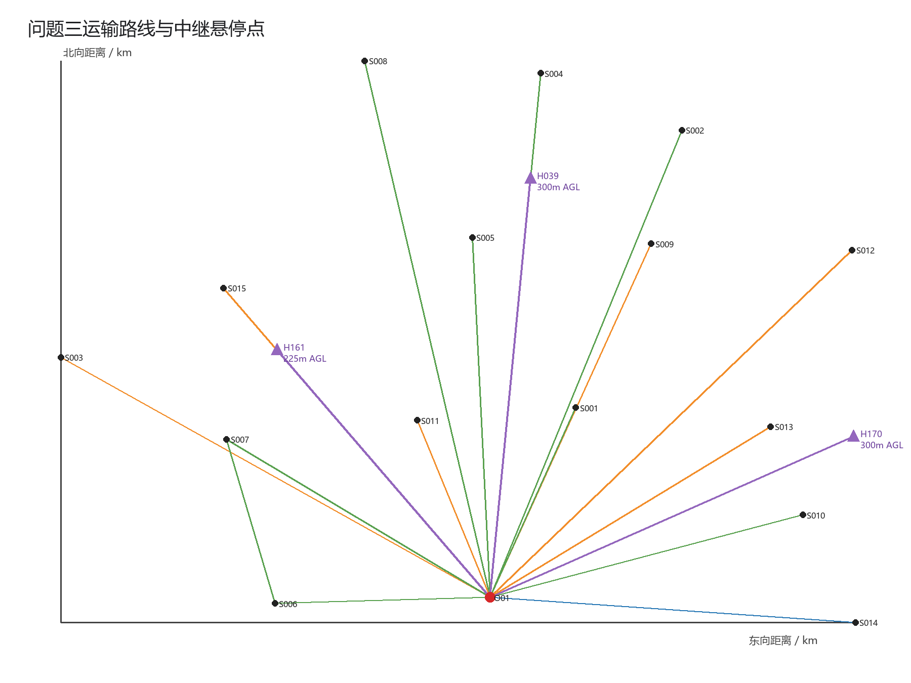
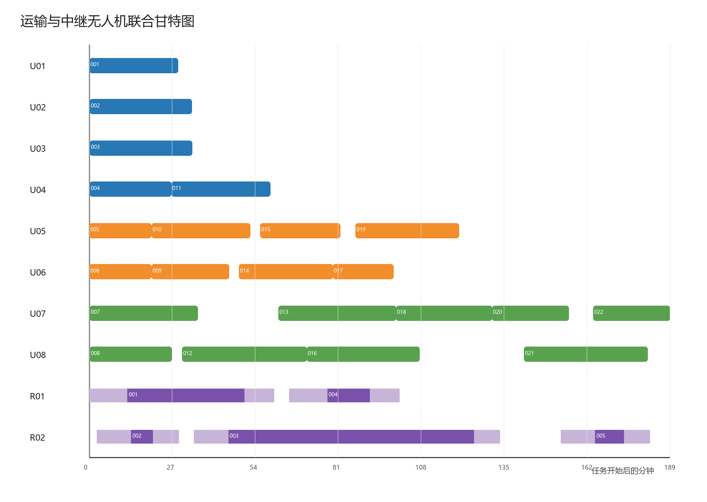
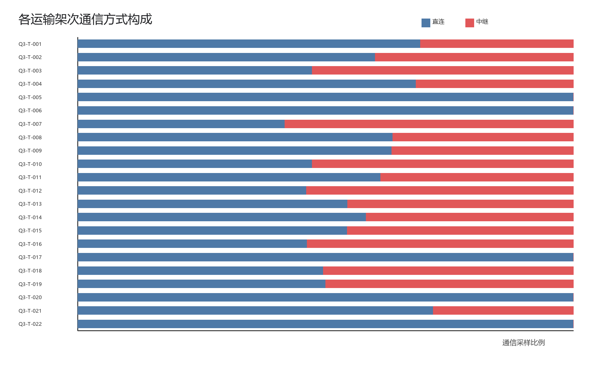
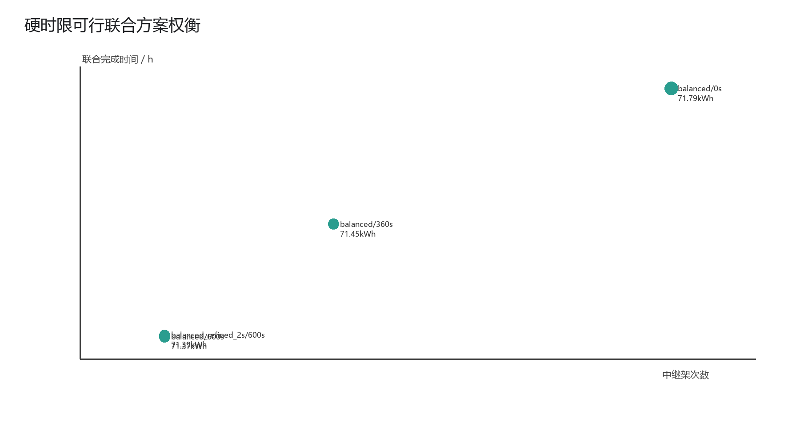

# 问题三：通信约束下运输与中继联合调度

## 1. 数据继承、假设与时间口径

问题三继承问题二的80个不可拆货箱、运输航段、载荷—能量模型、8架实体运输无人机和14组共享电池。通信保障从运输机起飞开始，连续覆盖爬升、巡航、下降和服务区物资交接，准备与装载发生在O01工位，不计入空中通信区间。固定网关G01位于O01，天线海拔为O01地面高程加20m。

中继无人机从O01完成准备后出发，抵达悬停点并完成30s建链后开始服务，服务结束即返航。返航后的300s周转时间约束同一中继机再次出动，但联合任务完成时间取返航时刻。每个中继架次使用一组满电能源组件；返航后组件按题目两阶段充电曲线充满方可复用。题目没有限制单架中继同时接入的运输机数量，因此同一悬停点链路预算满足时允许并行保障多架运输机。

## 2. 连续通信模型

任意端点a、b之间的双向损耗门限为

\[
L_{\max}^{a\leftrightarrow b}=\min\{L_{\max}^{a	o b},L_{\max}^{b	o a}\}.
\]

根据附件参数，运输机—G01直连、运输机—中继接入、中继—G01回传的双向门限分别为122、116和126dB。三维距离为D km时，考虑地形遮挡的传播损耗为

\[
L_{path}=32.45+20\log_{10}2400+20\log_{10}D+10b,
\]

其中b由30m DEM上的端点视线剖面决定。运输机在时刻t通信可行，当且仅当直连可用，或存在同一时刻正在服务的中继架次r，使接入与回传链路同时可用：

\[
A_{T,G}(t)=1\quad	ext{或}\quad A_{T,r}(t)A_{r,G}(t)=1.
\]

运输轨迹被展开为爬升、水平巡航、下降与投送交接的分段连续函数。主求解用10s网格并加入全部阶段端点，最终方案再以2s网格重建窗口；独立验证使用2s网格和30m DEM视线采样，共检查15480个时空点，通信中断为0。

## 3. 中继时间与能量模型

悬停点离地高度h不超过300m。往返巡航海拔取航线DEM最高点以上50m与悬停海拔中的较大者。中继架次能耗为

\[
E_r=P_{cr}(t_{hor}^{out}+t_{hor}^{back})/3600
+m_Rg(h_{up}^{out}+h_{up}^{back})/(3.6	imes10^6\eta_R)
+(P_{hover}+P_{comm})\Delta t_r/3600,
\]

并满足E_r≤0.8×3.2=2.56kWh。两架中继机的任务及周转区间不可重叠，6组能源组件的占用与充电区间不可重叠。

## 4. 多目标优化与方法原理

硬约束包括货箱唯一交付、运输质量/体积/能量、医疗与首批时限、两类无人机及能源资源可用性、悬停高度和连续通信。硬约束满足后，比较

\[
J=(J_{late},J_{ratio},T_{joint},E_T+E_R,N_T,N_R),
\]

其中J_late为优先系数加权相对迟到，J_ratio为优先系数加权交付时刻比例；T_joint取运输与中继最后返航时刻；N_T、N_R分别为运输和中继架次。

求解流程为：展开问题二候选运输路线；在服务区方向分数点与区域中点生成悬停位置，并枚举150/225/300m离地高度；筛除回传或返航能量不可行状态；计算每个运输架次直连失效区间及可完整覆盖它的悬停状态；采用集合覆盖与随机邻域指派减少悬停点；合并同点相邻服务窗口并按续航切分；最后用离散事件修复向后推迟冲突运输任务，同时传播运输机、电池、中继机和能源组件的可用时刻。算法使用固定随机种子，可复现，但候选集非支配性不等同于全局最优证明。

## 5. 主方案结果

- 全部80箱交付，硬时限违反0箱，期望时间内交付63箱；最紧硬时限余量为1114.140963s。
- 运输22架次、中继5架次，联合架次27次。
- 联合任务完成时间11339.306274s，即3.149807h。
- 运输能耗67.304897kWh，中继能耗4.084201kWh，总能耗71.389098kWh。
- 使用8架运输机、13组运输电池、2架中继机和3组中继能源组件；中继最低返航SOC为46.274333%。
- 17个运输架次需要中继、5个架次全程可直连；全部通信采样中直连比例为0.621253。接入链路最小裕量0.714530dB，回传链路最小裕量0.520920dB。

### 5.1 运输架次

|运输架次|无人机|机型|电池|开始/s|访问顺序|返航/s|能耗/kWh|返航SOC|货箱|
|---|---|---|---|---|---|---|---|---|---|
|Q3-T-001|U01|A|BAT-A-01|0.000000|S007|1727.466886|1.905383|0.576581|S007-MED-01;S007-WAT-01|
|Q3-T-002|U02|A|BAT-A-02|5.409454|S014|1995.808339|2.290878|0.490916|S014-MED-01;S014-WAT-01|
|Q3-T-003|U03|A|BAT-A-03|5.409454|S002|2009.184663|2.920018|0.351107|S002-MED-01;S002-WAT-01|
|Q3-T-004|U04|A|BAT-A-04|5.409454|S010|1600.302124|1.867965|0.584897|S010-FOD-01|
|Q3-T-005|U05|B|BAT-B-01|0.000000|S001|1209.106176|1.073972|0.731507|S001-MED-01;S001-MED-02;S001-WAT-01|
|Q3-T-006|U06|B|BAT-B-02|0.000000|S006|1207.270011|1.098747|0.725313|S006-MED-01;S006-WAT-01|
|Q3-T-007|U07|C|BAT-C-01|5.409454|S002|2113.251620|6.105797|0.236775|S002-FOD-01;S002-FOD-02;S002-HYG-01;S002-WAT-02;S002-WAT-03;S002-WAT-04|
|Q3-T-008|U08|C|BAT-C-02|5.409454|S010|1608.141819|3.149861|0.606267|S010-MED-01;S010-WAT-01|
|Q3-T-009|U06|B|BAT-B-03|1212.679465|S013|2723.191054|1.824828|0.543793|S013-FOD-01;S013-MED-01;S013-WAT-01|
|Q3-T-010|U05|B|BAT-B-04|1214.515630|S012|3137.342444|2.752600|0.311850|S012-FOD-01;S012-MED-01;S012-WAT-01|
|Q3-T-011|U04|A|BAT-A-05|1600.302124|S014|3530.701009|2.188493|0.513668|S014-FOD-01|
|Q3-T-012|U08|C|BAT-C-03|1808.686625|S003|4244.864336|6.324499|0.209438|S003-FOD-01;S003-MED-01;S003-WAT-01;S003-WAT-02;S003-WAT-03;S003-WAT-04|
|Q3-T-013|U07|C|BAT-C-04|3690.058922|S004|5991.113640|6.152860|0.230892|S004-FOD-01;S004-HYG-01;S004-MED-01;S004-WAT-01;S004-WAT-02;S004-WAT-03|
|Q3-T-014|U06|B|BAT-B-01|2923.735861|S015|4752.063421|2.307529|0.423118|S015-FOD-01;S015-MED-01;S015-WAT-01|
|Q3-T-015|U05|B|BAT-B-02|3337.887251|S009|4896.350115|2.096265|0.475934|S009-FOD-01;S009-MED-01;S009-WAT-01|
|Q3-T-016|U08|C|BAT-C-02|4244.864336|S008|6444.575861|5.836021|0.270497|S008-FOD-01;S008-HYG-01;S008-MED-01;S008-WAT-01;S008-WAT-02|
|Q3-T-017|U06|B|BAT-B-03|4752.063421|S011|5940.488184|1.073937|0.731516|S011-FOD-01;S011-MED-01;S011-WAT-01|
|Q3-T-018|U07|C|BAT-C-01|5991.113640|S005|7868.302356|4.222137|0.472233|S005-FOD-01;S005-HYG-01;S005-MED-01;S005-WAT-01;S005-WAT-02;S005-WAT-03|
|Q3-T-019|U05|B|BAT-B-04|5197.347231|S003|7217.956896|2.424255|0.393936|S003-FOD-02;S003-HYG-01|
|Q3-T-020|U07|C|BAT-C-03|7868.302356|S001|9362.477402|2.995776|0.625528|S001-FOD-01;S001-WAT-02;S001-WAT-03;S001-WAT-04;S001-WAT-05;S001-WAT-06|
|Q3-T-021|U08|C|BAT-C-04|8490.846592|S006-S007|10904.427042|4.288047|0.463994|S006-FOD-01;S006-HYG-01;S006-WAT-02;S006-WAT-03;S007-FOD-01;S007-HYG-01;S007-WAT-02|
|Q3-T-022|U07|C|BAT-C-01|9845.131228|S001|11339.306274|2.405028|0.699371|S001-FOD-02;S001-FOD-03;S001-HYG-01;S001-HYG-02;S001-WAT-07;S001-WAT-08|

### 5.2 中继架次与悬停方案

|中继架次|中继机|能源组件|悬停点|x/m|y/m|离地高度/m|飞行海拔/m|开始/s|服务开始/s|服务结束/s|返航/s|能耗/kWh|返航SOC|保障运输架次|
|---|---|---|---|---|---|---|---|---|---|---|---|---|---|---|
|Q3-R-001|R01|RE-R-01|H170|5383.577035|2361.878778|300.000000|705.633240|1.000000|747.409454|3024.302124|3608.872681|0.997499|0.688282|Q3-T-002;Q3-T-003;Q3-T-004;Q3-T-007;Q3-T-008;Q3-T-009;Q3-T-010;Q3-T-011|
|Q3-R-002|R02|RE-R-02|H161|-3155.289984|3627.561235|225.000000|691.091492|146.631333|818.000000|1238.000000|1746.317958|0.383202|0.880249|Q3-T-001|
|Q3-R-003|R02|RE-R-03|H161|-3155.289984|3627.561235|225.000000|691.091492|2047.317958|2718.686625|7511.113640|8019.431599|1.719221|0.462743|Q3-T-012;Q3-T-014;Q3-T-015;Q3-T-016;Q3-T-018;Q3-T-019|
|Q3-R-004|R01|RE-R-02|H039|600.309725|6142.480646|300.000000|618.646210|3909.872681|4654.058922|5480.058922|6055.157346|0.558910|0.825341|Q3-T-013|
|Q3-R-005|R02|RE-R-02|H161|-3155.289984|3627.561235|225.000000|691.091492|9213.477925|9884.846592|10442.846592|10951.164550|0.425369|0.867072|Q3-T-021|

### 5.3 各服务区交付时刻

|service_id|箱数|最早送达_s|最晚送达_s|
|---|---|---|---|
|S001|15.000000|917.676421|11027.403751|
|S002|8.000000|1289.237058|1492.740537|
|S003|8.000000|3454.235481|6485.625397|
|S004|6.000000|5273.556281|5273.556281|
|S005|6.000000|7364.342998|7364.342998|
|S006|6.000000|882.398339|9658.267904|
|S007|5.000000|1141.373443|10344.586693|
|S008|5.000000|5742.560099|5742.560099|
|S009|3.000000|4428.708683|4428.708683|
|S010|3.000000|1050.392456|1101.580637|
|S011|3.000000|5658.462469|5658.462469|
|S012|3.000000|2485.859037|2485.859037|
|S013|3.000000|2275.468593|2275.468593|
|S014|3.000000|1278.165563|2813.058233|
|S015|3.000000|4141.339641|4141.339641|

完整80箱逐箱送达时刻见`tables/box_deliveries.csv`及结果工作簿。

## 6. 指标权衡

硬时限可行候选对照：

|policy|merge_gap_s|on_time_boxes|joint_makespan_s|total_energy_kwh|transport_trips|relay_trips|
|---|---|---|---|---|---|---|
|balanced|0.000000|61.000000|13360.590787|71.786811|22.000000|8.000000|
|balanced|360.000000|63.000000|12248.856359|71.451173|22.000000|6.000000|
|balanced|600.000000|63.000000|11323.896820|71.372778|22.000000|5.000000|

600s窗口合并允许中继在相邻保障任务之间继续悬停，减少返航、再准备和重新建链，因此中继架次由8次降至5次，同时释放中继机，使运输任务的资源冲突延迟缩短。与不考虑通信的第二问22架次方案相比，运输能耗保持不变，新增中继能耗4.084201kWh；联合完成时间增加1396.284800s。

更少运输架次并不必然产生可行联合方案。17运输架次候选虽然总能耗较低、联合架次仅26次，但中继资源修复后出现硬时限违反：

|policy|merge_gap_s|hard_violations|max_hard_lateness_s|joint_makespan_s|total_energy_kwh|transport_trips|relay_trips|
|---|---|---|---|---|---|---|---|
|balanced|180.000000|4.000000|227.659583|13339.801927|71.795023|22.000000|8.000000|
|timely|0.000000|4.000000|1208.434855|11349.743677|65.683114|17.000000|9.000000|
|timely|180.000000|2.000000|1171.937193|11304.295044|65.640549|17.000000|9.000000|
|timely|360.000000|4.000000|1208.434855|11349.743677|65.683114|17.000000|9.000000|
|timely|600.000000|4.000000|1314.684855|11412.769017|65.709787|17.000000|9.000000|

这说明运输合批减少了运输能耗和架次数，却延长了单条运输路线并集中占用中继窗口；在只有2架中继机的条件下，为避免通信冲突而产生的推迟会破坏早期保障时限。因此本问采用“硬时限与连续通信优先，其次及时性和联合完成时间，再比较总能耗与两类架次数”的优先关系。

## 7. 资源与通信可行性

独立验证共16项，失败0项。验证内容包括80箱不重不漏、硬时限、运输与中继返航SOC、悬停高度、8架运输机与14组运输电池互斥、2架中继机周转、6组能源组件充电、中继飞行/悬停能耗复算以及连续通信。所有检查通过。

## 8. 输出文件

- `tables/transport_plan.csv`：运输路线、箱组、具体无人机、电池和时刻；
- `tables/box_deliveries.csv`：80箱逐箱送达时刻；
- `tables/relay_plan.csv`：中继悬停坐标、海拔、服务窗口、能源组件和保障对象；
- `tables/communication_summary.csv`及`communication_timeline_2s.csv`：通信状态与链路裕量；
- `tables/resource_usage.csv`：四类实体资源占用和再次可用时刻；
- `verification.json`：独立验证结果。

## 9. 结果图

